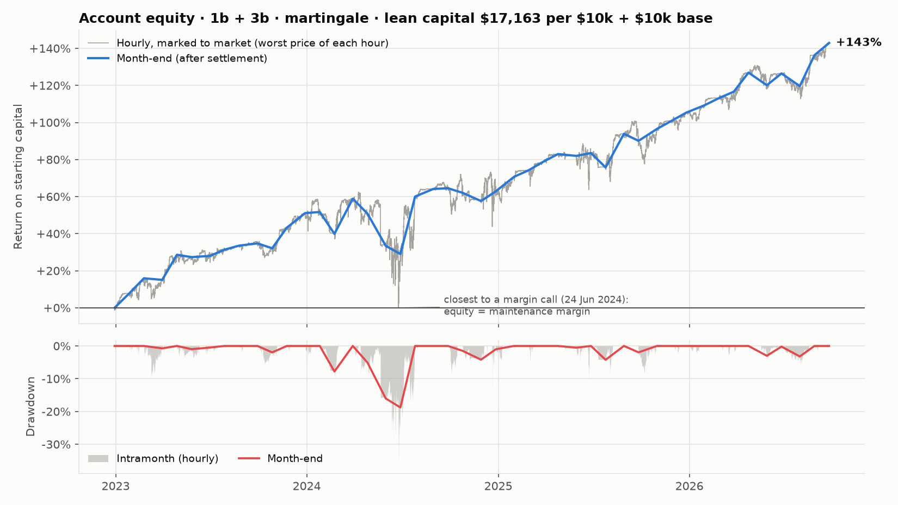
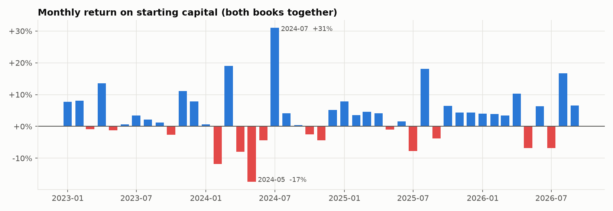
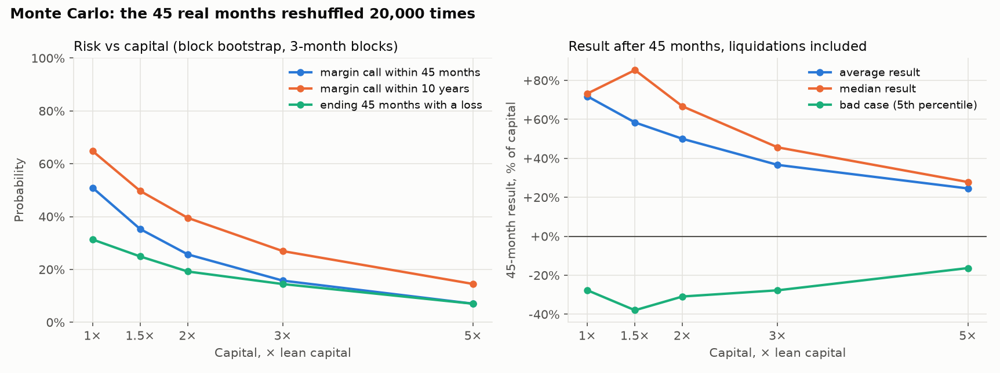
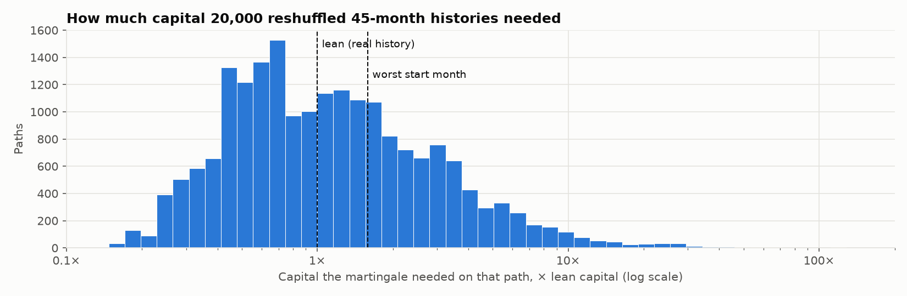

# Portfolio 1b + 3b: martingale on lean capital, with risk statistics

**Setup:** one USD account (stablecoin collateral) running two strategies at the same time. Each strategy has
its own martingale.

* **1b:** sell an ATM ETH put only after an up month, with no hedge.
* **3b:** after an up month sell an ATM put, after a down month sell an ATM call. Each is hedged with the perp:
  short below last month's low (for a put) or long above last month's high (for a call). The stop is at the opposite extreme,
  and the hedge re-enters on every new break.
* **Martingale:** each strategy sizes its next trade as base + (its own losses still to recover) ÷ premium. It goes back
  to base once those losses are recovered. The two strategies do not share losses.
* **Base trade:** $10,000 of ETH notional per strategy. Every $ figure scales linearly.
* **Lean capital:** the **least money the account needed**. It is the smallest starting balance that never fell below
  Deribit maintenance margin, checked every hour at the hour's high and low, for both strategies together.
  There is no safety buffer. All returns and risk figures below are measured on this balance, unless a column says otherwise.
* **Data:** real Deribit data from Jan 2023 to Sep 2026 (45 monthly expiries), including option IV, perp prices, funding and fees.

---

## Summary: what the results mean for you

1. **Lean capital is $17,163 per $10k + $10k of base trades.** With **$100k, each strategy trades a base of about
   $58.3k notional.** Both strategies together need less than 3b alone ($18,267), because 1b's early profits
   act as a cushion.
2. **Historical result on lean capital: $24,527, which is 143% in 45 months, or about
   27%/yr.**
   * 69% of months were profitable.
   * Sharpe 1.29, Sortino 2.73, profit factor 2.8.
   * 1b alone made $8,044 and 3b alone made $16,483.
3. **The risk at lean capital, from the real path:**
   * Worst month: **-17.4%** (2024-05).
   * VaR 95%: 8.0% a month. CVaR 95%: 12.4%.
   * Max drawdown: **18.8%** on month-end equity (2024-06), and **37.1%**
     intramonth at the worst hour.
   * Positions reached **5.2× the capital** in notional (2.1× / 7.9× base size for 1b / 3b).
   * The longest time under water was 3 months.
   * **By construction, the account touched maintenance margin once.** One more bad hour would have meant liquidation.
4. **Monte Carlo on the martingale's tail risk.** I reshuffled the 45 real months in 3-month blocks, 20,000 times:
   * **At lean capital, 51% of paths hit a margin call within 45 months.** Over 10 years it is 65%.
     In those paths, the martingale needed more money than the real history did.
   * A margin call does not wipe out the account. Liquidated paths had made profits before, so on average they ended
     at -1% of capital. Including them, lean capital returned **+72% on average**
     (median +73%) over 45 months.
     **31% of paths ended with a loss.** The bad case (5th percentile) was -28%.
   * **With 2× lean capital** ($34,326), the margin-call chance drops to 26%, and the chance of a loss to 19%.
     The average return falls to +50%.
   * If the martingale had unlimited capital, it would end in profit in 99.8% of paths. But the capital needed
     has a fat tail: the median path needed 1.0× lean, 10% of paths needed 3.9×,
     and 1% needed 16×. The largest multiplier was 41× in 5% of paths and 97× in 1%.
5. **How to run it lean without being liquidated:**
   * Keep **a second lean-sized amount off the exchange as a top-up reserve** (about $17,163 per $10k + $10k base).
     Move it in only when a margin call comes. That is the 2× column. About 51% of paths would use the reserve,
     and 26% would need more than both amounts together.
   * Starting at a bad moment needs more capital. The worst start month in history needed $27,267 (1.6× lean).
   * The biggest danger is a run of losing calls in a strong rally, like May–Jul 2025, where 3b's size grows fastest.
     If 3b's multiplier goes above 8×, you are outside anything the real history produced. That is the moment
     to add capital or stop the martingale.





---

## Risk statistics on the real path

The first column is lean capital. The other columns show the same trades on more capital, for comparison. The Sharpe
ratio stays the same, while leverage, drawdown and return scale down.

| Risk statistic | **1× lean** | 1.5× lean | 2× lean | 3× lean | 5× lean |
|---|---:|---:|---:|---:|---:|
| Starting capital | $17,163 | $25,745 | $34,326 | $51,489 | $85,815 |
| Total P&L | $24,527 | $24,527 | $24,527 | $24,527 | $24,527 |
| Total return | 142.9% | 95.3% | 71.5% | 47.6% | 28.6% |
| Annual return (on starting capital) | 26.7% | 19.5% | 15.5% | 10.9% | 6.9% |
| Average month | 3.2% | 2.1% | 1.6% | 1.1% | 0.6% |
| Median month | 3.6% | 2.4% | 1.8% | 1.2% | 0.7% |
| Monthly volatility | 8.5% | 5.7% | 4.3% | 2.8% | 1.7% |
| Sharpe (annualised, rf=0) | 1.29 | 1.29 | 1.29 | 1.29 | 1.29 |
| Sortino (annualised) | 2.73 | 2.73 | 2.73 | 2.73 | 2.73 |
| Positive months | 68.9% | 68.9% | 68.9% | 68.9% | 68.9% |
| Profit factor (gains / losses) | 2.80 | 2.80 | 2.80 | 2.80 | 2.80 |
| Average win / average loss | 1.26 | 1.26 | 1.26 | 1.26 | 1.26 |
| Best month | 31.0% | 20.7% | 15.5% | 10.3% | 6.2% |
| Worst month | -17.4% | -11.6% | -8.7% | -5.8% | -3.5% |
| VaR 95% (monthly) | 8.0% | 5.3% | 4.0% | 2.7% | 1.6% |
| CVaR 95% (monthly) | 12.4% | 8.3% | 6.2% | 4.1% | 2.5% |
| Max drawdown (month-end) | 18.8% | 14.3% | 11.5% | 8.3% | 5.3% |
| Max drawdown (intramonth, hourly) | 37.1% | 28.2% | 22.8% | 16.4% | 10.5% |
| Calmar (annual return / max DD) | 0.72 | 0.69 | 0.68 | 0.67 | 0.66 |
| Longest time under water (months) | 3 | 3 | 3 | 3 | 3 |
| Losing months | 14 of 45 | 14 of 45 | 14 of 45 | 14 of 45 | 14 of 45 |
| Max losing streak 1b / 3b | 3 / 3 | 3 / 3 | 3 / 3 | 3 / 3 | 3 / 3 |
| Max size 1b / 3b (× base) | 2.1× / 7.9× | 2.1× / 7.9× | 2.1× / 7.9× | 2.1× / 7.9× | 2.1× / 7.9× |
| Max combined notional | $89,108 | $89,108 | $89,108 | $89,108 | $89,108 |
| Max notional / capital (leverage) | 5.2× | 3.5× | 2.6× | 1.7× | 1.0× |
| Largest open loss inside a month | 33.5% | 22.3% | 16.7% | 11.2% | 6.7% |

Definitions:

* Monthly figures are P&L divided by starting capital. Sizes do not compound, so returns are not reinvested.
* The intramonth drawdown uses the hourly marked-to-market equity, at the worst price of each hour, against the previous
  month-end peak.
* "Largest open loss inside a month" is the worst unrealised loss on the open positions at any hour.

## Monte Carlo: chance of liquidation and final result

| Monte Carlo (45 months, 3-month blocks) | 1× lean | 1.5× lean | 2× lean | 3× lean | 5× lean |
|---|---:|---:|---:|---:|---:|
| Starting capital per $10k + $10k base | $17,163 | $25,745 | $34,326 | $51,489 | $85,815 |
| **Chance of a margin call (liquidation)** | **51%** | **35%** | **26%** | **16%** | **7%** |
| Chance of ending with a loss | 31% | 25% | 19% | 14% | 7% |
| Average result | +72% | +58% | +50% | +37% | +25% |
| Median result | +73% | +85% | +67% | +46% | +28% |
| Bad case (5th percentile) | -28% | -38% | -31% | -28% | -16% |
| Average result of the paths that got liquidated | -1% | -11% | -13% | -20% | -23% |
| Margin call, 1-month blocks (no streaks kept) | 64% | 49% | 40% | 27% | 16% |
| Margin call, 6-month blocks (long streaks kept) | 43% | 25% | 13% | 7% | 2% |
| Margin call within 10 years (3-month blocks) | 65% | 50% | 40% | 27% | 14% |





How the Monte Carlo works:

* Each path draws months from the real 45 in blocks of 3 consecutive months, keeping some of the real losing streaks.
* Every month keeps its own real price path, implied vol, hedge fills and "last month up/down" signal.
* Both strategies run their martingales on the path.
* **A margin call is the first hour the combined equity falls below Deribit maintenance margin**, or when the next
  martingale step cannot be opened. At that point, everything is closed at that hour's worst price, minus a 1% liquidation cost, and trading stops.
* Blocks of 1 month (no streaks) and 6 months (long streaks) are shown as the plausible range.
* The month-to-month clustering of real markets is only partly captured, so treat these figures as estimates, not precise odds.

---

## Month by month (lean capital $17,163)

| Month | ETH | Last month | 1b trade | 1b P&L | 3b trade | 3b hedge | 3b P&L | Month P&L | Return | Equity | Drawdown | Worst open loss |
|---|---:|---|---|---:|---|---:|---:|---:|---:|---:|---:|---:|
| 2023-01 | +33.3% | up | PUT 1.00× | $667 | PUT 1.00× | – | $667 | $1,335 | +7.8% | $18,498 | 0.0% | $236 |
| 2023-02 | +4.4% | up | PUT 1.00× | $699 | PUT 1.00× | – | $699 | $1,398 | +8.1% | $19,895 | 0.0% | $608 |
| 2023-03 | +8.3% | up | PUT 1.00× | $827 | PUT 1.00× | -$1,801 (1) | -$974 | -$148 | -0.9% | $19,748 | 0.7% | $1,917 |
| 2023-04 | +7.3% | up | PUT 1.00× | $675 | PUT 2.44× | – | $1,650 | $2,325 | +13.5% | $22,073 | 0.0% | $336 |
| 2023-05 | -5.5% | up | PUT 1.00× | $30 | PUT 1.00× | -$278 (1) | -$248 | -$219 | -1.3% | $21,854 | 1.0% | $838 |
| 2023-06 | +3.9% | down | – | – | CALL 1.46× | – | $111 | $111 | +0.6% | $21,965 | 0.5% | $709 |
| 2023-07 | -1.2% | up | PUT 1.00× | $253 | PUT 1.30× | – | $328 | $580 | +3.4% | $22,546 | 0.0% | $598 |
| 2023-08 | -11.3% | down | – | – | CALL 1.00× | – | $374 | $374 | +2.2% | $22,920 | 0.0% | $106 |
| 2023-09 | +1.8% | down | – | – | CALL 1.00× | – | $208 | $208 | +1.2% | $23,128 | 0.0% | $430 |
| 2023-10 | +6.2% | up | PUT 1.00× | $414 | PUT 1.00× | -$1,285 (1) | -$871 | -$457 | -2.7% | $22,672 | 2.0% | $1,318 |
| 2023-11 | +16.3% | up | PUT 1.00× | $520 | PUT 2.68× | – | $1,391 | $1,911 | +11.1% | $24,582 | 0.0% | $532 |
| 2023-12 | +13.1% | up | PUT 1.00× | $673 | PUT 1.00× | – | $673 | $1,346 | +7.8% | $25,928 | 0.0% | $449 |
| 2024-01 | -6.1% | up | PUT 1.00× | $54 | PUT 1.00× | – | $54 | $108 | +0.6% | $26,036 | 0.0% | $1,667 |
| 2024-02 | +33.2% | down | – | – | CALL 1.00× | $853 (1) | -$2,031 | -$2,031 | -11.8% | $24,005 | 7.8% | $2,017 |
| 2024-03 | +20.5% | up | PUT 1.00× | $615 | PUT 4.30× | – | $2,646 | $3,261 | +19.0% | $27,267 | 0.0% | $471 |
| 2024-04 | -11.3% | up | PUT 1.00× | -$346 | PUT 1.00× | -$685 (1) | -$1,031 | -$1,378 | -8.0% | $25,889 | 5.1% | $2,376 |
| 2024-05 | +18.9% | down | – | – | CALL 2.30× | -$175 (1) | -$2,994 | -$2,994 | -17.4% | $22,895 | 16.0% | $3,056 |
| 2024-06 | -8.0% | up | PUT 1.55× | -$130 | PUT 7.36× | – | -$620 | -$751 | -4.4% | $22,144 | 18.8% | $5,742 |
| 2024-07 | -5.1% | down | – | – | CALL 7.91× | – | $5,318 | $5,318 | +31.0% | $27,462 | 0.0% | $1,090 |
| 2024-08 | -22.5% | down | – | – | CALL 1.00× | – | $709 | $709 | +4.1% | $28,172 | 0.0% | $201 |
| 2024-09 | +5.4% | down | – | – | CALL 1.00× | – | $60 | $60 | +0.4% | $28,232 | 0.0% | $141 |
| 2024-10 | -7.0% | up | PUT 1.69× | -$267 | PUT 1.00× | – | -$158 | -$425 | -2.5% | $27,807 | 1.5% | $2,416 |
| 2024-11 | +43.4% | down | – | – | CALL 1.23× | $3,633 (1) | -$760 | -$760 | -4.4% | $27,047 | 4.2% | $888 |
| 2024-12 | -6.0% | up | PUT 2.11× | $421 | PUT 2.38× | – | $473 | $893 | +5.2% | $27,940 | 1.0% | $2,371 |
| 2025-01 | -2.5% | down | – | – | CALL 1.49× | – | $1,350 | $1,350 | +7.9% | $29,291 | 0.0% | $1,056 |
| 2025-02 | -35.3% | down | – | – | CALL 1.00× | – | $609 | $609 | +3.6% | $29,900 | 0.0% | $355 |
| 2025-03 | -9.1% | down | – | – | CALL 1.00× | – | $791 | $791 | +4.6% | $30,691 | 0.0% | $1,490 |
| 2025-04 | -7.2% | down | – | – | CALL 1.00× | – | $707 | $707 | +4.1% | $31,399 | 0.0% | $118 |
| 2025-05 | +48.1% | down | – | – | CALL 1.00× | $3,743 (1) | -$169 | -$169 | -1.0% | $31,229 | 0.5% | $484 |
| 2025-06 | -7.0% | up | PUT 1.46× | $144 | PUT 1.24× | – | $122 | $266 | +1.5% | $31,495 | 0.0% | $3,122 |
| 2025-07 | +48.2% | down | – | – | CALL 1.06× | $3,138 (1) | -$1,332 | -$1,332 | -7.8% | $30,163 | 4.2% | $1,356 |
| 2025-08 | +21.3% | up | PUT 1.23× | $956 | PUT 2.78× | – | $2,156 | $3,112 | +18.1% | $33,275 | 0.0% | $1,326 |
| 2025-09 | -10.7% | up | PUT 1.00× | -$325 | PUT 1.00× | – | -$325 | -$650 | -3.8% | $32,625 | 2.0% | $1,104 |
| 2025-10 | -2.3% | down | – | – | CALL 1.42× | – | $1,099 | $1,099 | +6.4% | $33,724 | 0.0% | $2,144 |
| 2025-11 | -21.4% | down | – | – | CALL 1.00× | – | $754 | $754 | +4.4% | $34,479 | 0.0% | $141 |
| 2025-12 | -1.5% | down | – | – | CALL 1.00× | – | $756 | $756 | +4.4% | $35,234 | 0.0% | $873 |
| 2026-01 | -7.9% | down | – | – | CALL 1.00× | – | $687 | $687 | +4.0% | $35,921 | 0.0% | $776 |
| 2026-02 | -25.7% | down | – | – | CALL 1.00× | – | $671 | $671 | +3.9% | $36,593 | 0.0% | $107 |
| 2026-03 | +1.9% | down | – | – | CALL 1.00× | – | $586 | $586 | +3.4% | $37,179 | 0.0% | $1,068 |
| 2026-04 | +11.9% | up | PUT 1.45× | $1,046 | PUT 1.00× | – | $721 | $1,766 | +10.3% | $38,945 | 0.0% | $849 |
| 2026-05 | -13.4% | up | PUT 1.00× | -$584 | PUT 1.00× | – | -$584 | -$1,169 | -6.8% | $37,776 | 3.0% | $1,508 |
| 2026-06 | -21.2% | down | – | – | CALL 2.16× | – | $1,090 | $1,090 | +6.4% | $38,867 | 0.2% | $332 |
| 2026-07 | +19.5% | down | – | – | CALL 1.00× | – | -$1,170 | -$1,170 | -6.8% | $37,697 | 3.2% | $1,757 |
| 2026-08 | +32.3% | up | PUT 2.06× | $1,136 | PUT 3.12× | – | $1,721 | $2,857 | +16.6% | $40,554 | 0.0% | $1,167 |
| 2026-09 | +7.0% | up | PUT 1.00× | $568 | PUT 1.00× | – | $568 | $1,136 | +6.6% | $41,690 | 0.0% | $547 |

"Worst open loss" is the largest unrealised loss on both strategies at any hour of that month.
The data is also in `results/portfolio_monthly.csv`.

## Re-running

```bash
python3 portfolio_report.py   # about 3 minutes, mostly the Monte Carlo
```

To change the base size, liquidation cost or capital multiples, edit `portfolio.py`.
