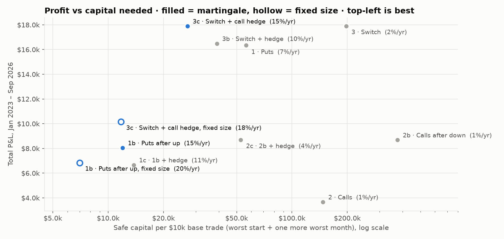
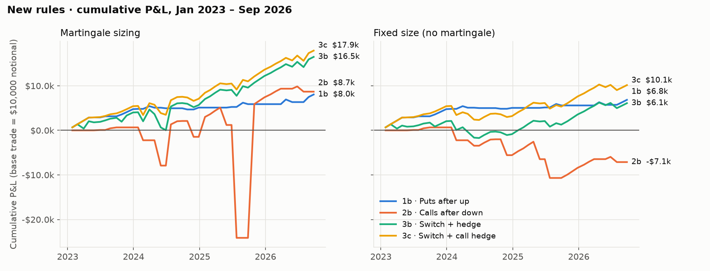
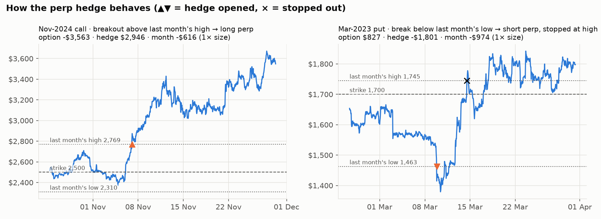
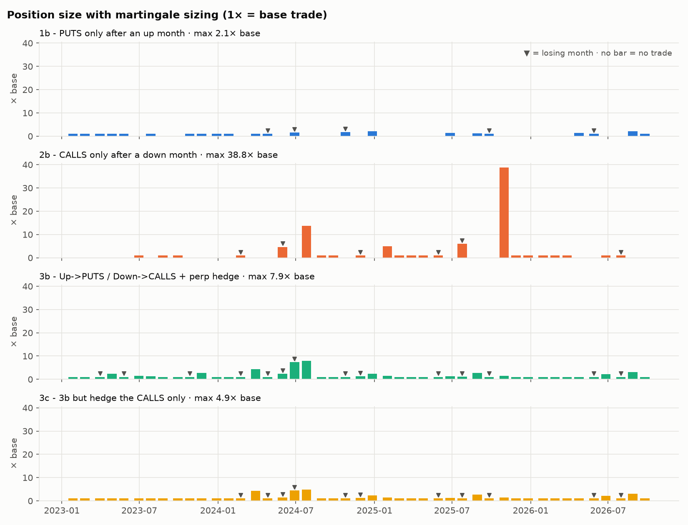
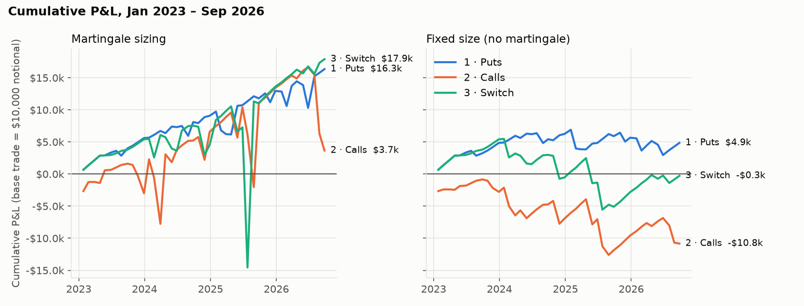
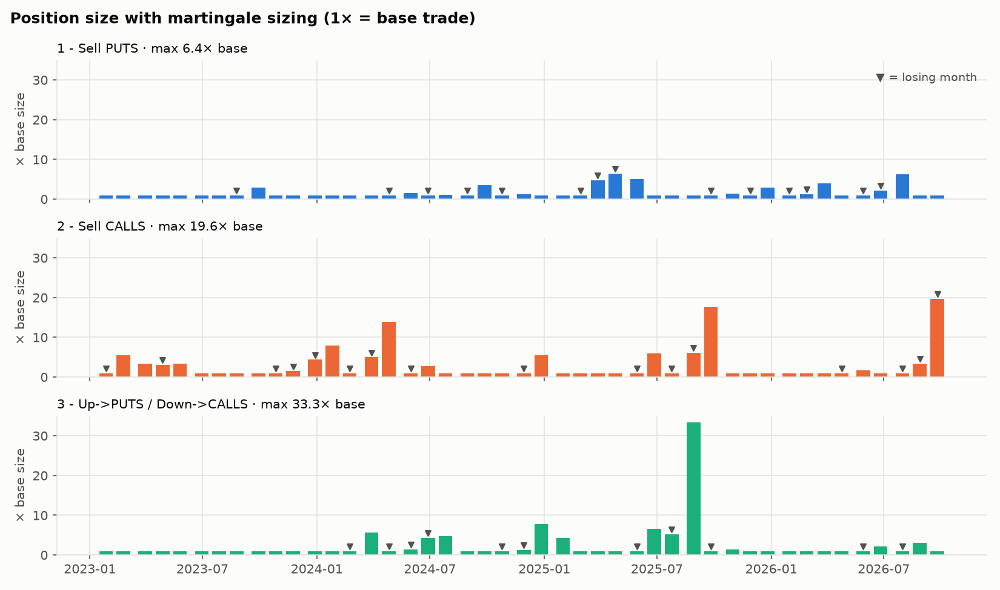
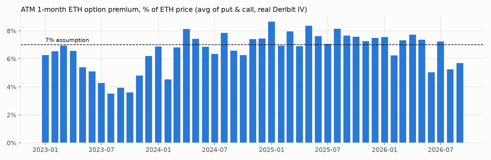

# Martingale ETH option selling: backtest, Jan 2023 to Sep 2026

> **Chosen setup (1b + 3b on one account, martingale, lean capital, risk statistics and Monte Carlo): [PORTFOLIO.md](PORTFOLIO.md)**

Every month, on Deribit's monthly expiry (the last Friday, 08:00 UTC), the strategy sells the at-the-money ETH
option that expires one month later. It is held to expiry and settled at Deribit's real delivery price.
"Last month" means the expiry-to-expiry month that just ended.

| # | Rule |
|---|---|
| 1 | Sell a put every month |
| 2 | Sell a call every month |
| 3 | Momentum: after an up month sell a put, after a down month sell a call |
| **1b** | **Sell a put only if last month was up**, otherwise skip the month |
| **2b** | **Sell a call only if last month was down**, otherwise skip the month |
| **3b** | **3 plus a perp hedge.** Short put: when ETH trades below last month's low, short the perp (same size as the option). Stop out when ETH trades above last month's high, and re-enter whenever the low is broken again. Short call: long the perp above last month's high, with the stop below last month's low. The hedge is closed at expiry. |
| 1c / 2c | 1b / 2b with the same hedge |
| 3c | 3b, but only the calls are hedged. I added this after seeing the 1c/2c results. |

**Martingale sizing:** after a losing month, the next trade is sized so that its premium covers the losses still
to be recovered, plus the normal premium. The size resets after the losses are recovered. In 1b and 2b,
**the losses to recover (and so the larger size) carry over the skipped months** and are used at the next month
the strategy is allowed to trade. The monthly result includes the hedge P&L.

All $ figures are for a **base trade of $10,000 ETH notional** (about $650 of premium a month). Every figure scales linearly.
The test covers 45 monthly expiries, Jan 2023 to Sep 2026. ETH went from $1,188 to $2,671.

---

## Summary: what the results mean for you

1. **The best new rule is 1b: sell puts only after an up month.** With martingale sizing it made **$8,044**
   from 22 trades, against $16,345 for puts every month. It needed **$5.8k of capital**
   instead of $37.6k. The position never went above **2.1×** the base, the worst month
   was -$584. **Safe capital** (explained below the tables) was **$12.0k**, a return of
   **15%/yr** on it.
   * The months it skips are the ones where puts lose. Fixed-size puts made $6,843 in 1b against
     $4,851 when sold every month.
   * The deep drops of Feb–Apr 2025, Nov 2025–Mar 2026 and Jun 2026 all came after down months, so 1b was not trading.
2. **2b: calls only after a down month. Do not trade this without the hedge.** It made $8,679, but at
   fixed size it lost $7,121. The martingale pushed the position to
   **39× ($387,673 notional)** in Oct 2025, after a -$25,324 month
   (Jul 2025, ETH +48%). That needed **$211.6k of capital**.
3. **3b: momentum plus the perp hedge.** The hedge cut the capital needed from $99.5k to
   **$22.9k** and the biggest position from 33× to 7.9×.
   The hedge made $7,143 over 9 fills. Total P&L was $16,483
   (10%/yr on safe capital of $39.0k).
4. **The hedge works for calls and fails for puts.** This held for every rule and stop level I tried.
   * **Call hedge:** it made $10,872 on 2b. When ETH breaks last month's high, the rally usually keeps going
     (Nov 2024, May 2025 and Jul 2025 each covered about 70–95% of the option loss). The capital needed for 2b fell from
     $211.6k to $30.5k.
   * **Put hedge:** it lost $4,049 on 1b. After an up month, a break below last month's low usually
     bounces back. The short perp is then stopped out at the high far above (Mar 2023: -$1.8k on a put that made +$0.8k),
     or held to expiry at a loss. A tighter stop (at the strike, or 5–10% above the low) did not fix it.
   * **So 3c, which hedges only the calls, is the best momentum version:** $17,892 with **$13.8k** of capital,
     a maximum of 4.9×, and **15%/yr** on safe capital of $27.0k.
5. **With full martingale sizing, the hedge does not change the total profit. It changes the risk.**
   A martingale's profit is roughly the base premium times the number of winning months. That is why 3 and 3c both end at $17,892,
   and 2b and 2c at $8,679. What the hedge (or the filter) changes is how large the position and the capital
   requirement get on the way. **Judge each version by the capital it needs, not by its profit.**
6. **Fixed size gives a better return on capital than the martingale.** The martingale earns more per base trade, but it
   needs more capital per base trade, and the capital grows faster than the profit. On safe capital:
   * 1b made **20%/yr at fixed size**, against 15%/yr with the martingale.
   * 3c made **18%/yr at fixed size**, against 15%/yr with the martingale.
   * Puts every month made 10%/yr at fixed size, against 7%/yr with the martingale.
   If your goal is the most profit from a given amount of money, use a bigger fixed size instead of the martingale.
7. **What to do:**
   * **Best overall: 1b at fixed size**, sell a put only after an up month. Hold about **$7.0k per $10k of base
     notional**, so **$100k supports about $142.7k of puts a month**. Fully cash-secured,
     with no leverage, it needs $10.7k per $10k.
   * **If you want the martingale: 1b with martingale sizing.** Hold **$12.0k per $10k**, so $100k supports a base trade of
     about $83.5k. The size never went above 2.1×.
   * **To trade every month: 3c**, momentum with the call hedge only. Hold $11.7k per $10k at fixed size, or
     $27.0k with the martingale. $100k supports about $85.3k or $37.1k of base notional.
   * If you use the martingale, cap the multiplier at about 4–5×.
   * Treat 3c as a hypothesis, not a proven edge. I picked it after seeing the results, from only 5 call-hedge fills. The
     explanation (ETH breakouts above a monthly high tend to continue) makes sense, but the sample is small.







---

## 1. New rules: full results

| Variant | Sizing | Total P&L | Months traded | Losing months | Max losing streak | Biggest position | Worst month | Hedge P&L | Capital (margin, worst start) | **Safe capital** | Capital (no leverage) | Return/yr on safe capital |
|---|---|---:|---:|---:|---:|---:|---:|---:|---:|---:|---:|---:|
| 1b - PUTS only after an up month | martingale | **$8,044** | 22 | 5 | 3 | 2.1× ($21,147) | -$584 | – | $5,781 | **$11,971** | $21,600 | 14.7% |
| 1b - PUTS only after an up month | last_only | **$7,732** | 22 | 5 | 3 | 2.1× ($20,600) | -$584 | – | $4,828 | **$10,858** | $21,327 | 15.4% |
| 1b - PUTS only after an up month | fixed | **$6,843** | 22 | 5 | 3 | 1.0× ($10,000) | -$584 | – | $4,080 | **$7,006** | $10,654 | 19.9% |
| 2b - CALLS only after a down month | martingale | **$8,679** | 23 | 6 | 2 | 38.8× ($387,673) | -$25,324 | – | $211,636 | **$375,059** | $416,910 | 0.6% |
| 2b - CALLS only after a down month | last_only | **$1,882** | 23 | 6 | 2 | 33.7× ($337,134) | -$25,324 | – | $187,857 | **$329,975** | $366,370 | 0.2% |
| 2b - CALLS only after a down month | fixed | **-$7,121** | 23 | 6 | 2 | 1.0× ($10,000) | -$4,215 | – | $19,509 | **$23,725** | $21,344 | -9.1% |
| 3b - Up->PUTS / Down->CALLS + perp hedge | martingale | **$16,483** | 45 | 14 | 3 | 7.9× ($79,062) | -$2,994 | $7,143 (9 fills) | $22,943 | **$39,003** | $83,707 | 9.9% |
| 3b - Up->PUTS / Down->CALLS + perp hedge | last_only | **$11,844** | 45 | 14 | 3 | 5.7× ($57,329) | -$2,994 | $6,964 (9 fills) | $18,755 | **$24,666** | $60,862 | 11.0% |
| 3b - Up->PUTS / Down->CALLS + perp hedge | fixed | **$6,099** | 45 | 14 | 3 | 1.0× ($10,000) | -$2,031 | $6,377 (9 fills) | $9,365 | **$11,396** | $13,832 | 12.1% |
| 3c - 3b but hedge the CALLS only | martingale | **$17,892** | 45 | 11 | 3 | 4.9× ($48,585) | -$2,031 | $11,257 (5 fills) | $13,786 | **$26,966** | $51,180 | 14.5% |
| 3c - 3b but hedge the CALLS only | last_only | **$15,137** | 45 | 11 | 3 | 4.3× ($43,027) | -$2,031 | $11,079 (5 fills) | $12,379 | **$24,972** | $44,571 | 13.5% |
| 3c - 3b but hedge the CALLS only | fixed | **$10,148** | 45 | 11 | 3 | 1.0× ($10,000) | -$2,031 | $10,426 (5 fills) | $8,792 | **$11,718** | $13,147 | 18.1% |
| 1c - 1b + perp hedge | martingale | **$6,660** | 22 | 8 | 3 | 3.5× ($35,431) | -$1,031 | -$4,049 (4 fills) | $10,121 | **$13,774** | $36,640 | 11.1% |
| 1c - 1b + perp hedge | last_only | **$5,558** | 22 | 8 | 3 | 2.7× ($26,756) | -$1,031 | -$4,049 (4 fills) | $7,789 | **$10,548** | $27,877 | 11.9% |
| 1c - 1b + perp hedge | fixed | **$2,794** | 22 | 8 | 3 | 1.0× ($10,000) | -$1,031 | -$4,049 (4 fills) | $4,690 | **$5,721** | $12,088 | 11.2% |
| 2c - 2b + perp hedge | martingale | **$8,679** | 23 | 6 | 2 | 10.9× ($109,128) | -$4,636 | $10,872 (5 fills) | $30,484 | **$52,652** | $115,795 | 4.2% |
| 2c - 2b + perp hedge | last_only | **$6,478** | 23 | 6 | 2 | 7.9× ($78,927) | -$4,636 | $10,872 (5 fills) | $23,893 | **$39,926** | $85,595 | 4.1% |
| 2c - 2b + perp hedge | fixed | **$3,305** | 23 | 6 | 2 | 1.0× ($10,000) | -$2,031 | $10,426 (5 fills) | $8,890 | **$10,921** | $13,332 | 7.3% |

The same table for the original rules 1, 2 and 3 is in section 2.

* **Capital (margin, worst start)**: the smallest USD balance that would never have been liquidated, for the worst possible
  start month between Jan 2023 and Sep 2026, under Deribit standard margin. Opening an option needs 15% of notional
  plus the mark. Keeping it open needs 7.5% plus the mark. The perp hedge needs 2% of its notional. Everything is marked every hour at
  both the high and the low of the hour.
* **Safe capital**: the worst-start capital, plus the loss if the worst month ever seen for that side hit the biggest
  position once more. For puts that month is Feb 2025 (ETH −35%). For calls it is May/Jul 2025 (ETH +48%), with or without the hedge
  as the rule uses it, and counting all 45 months, not only the months the rule traded. **This is the number to plan with.**
* **No leverage**: 1× notional set aside for every option (cash-secured put or fully funded call), plus any running hedge loss.
* **Return/yr**: total P&L as an annualised return on the safe capital, over the full 45 months, including months with no trade.
* **Sizing**: *martingale* recovers all losses since the last reset. *last_only* covers only the last traded month's loss.
  *fixed* never changes size.



### How the hedge performed

* **All hedge fills in the momentum rule (3b):** 9. Five were on calls: Feb 2024, May 2024, Nov 2024, May 2025 and Jul 2025.
  Four were on puts: Mar 2023, May 2023, Oct 2023 and Apr 2024.
* **Call fills:** net strongly positive. The breakouts ran through the strike, and the long perp made back most
  of the option loss. May 2024 roughly broke even: the breakout came late and ETH settled at the entry level.
* **Put fills:** net negative. The dips reversed, so the short perp either lost the whole low-to-high range when stopped
  (Mar 2023, Oct 2023) or was closed at a loss at expiry (May 2023, Apr 2024).
* **Costs included:** 0.05% taker fee plus 0.05% slippage on every perp fill, and the real hourly Deribit funding
  (longs paid on average about 4%/yr over the period).

---

## 2. Original rules (1, 2, 3)

| Variant | Sizing | Total P&L | Months traded | Losing months | Max losing streak | Biggest position | Worst month | Hedge P&L | Capital (margin, worst start) | **Safe capital** | Capital (no leverage) | Return/yr on safe capital |
|---|---|---:|---:|---:|---:|---:|---:|---:|---:|---:|---:|---:|
| 1 - Sell PUTS every month | martingale | **$16,345** | 45 | 14 | 3 | 6.4× ($63,729) | -$3,552 | – | $37,575 | **$56,227** | $68,243 | 7.0% |
| 1 - Sell PUTS every month | last_only | **$12,143** | 45 | 14 | 3 | 5.6× ($55,762) | -$3,552 | – | $18,907 | **$35,227** | $60,615 | 8.2% |
| 1 - Sell PUTS every month | fixed | **$4,851** | 45 | 14 | 3 | 1.0× ($10,000) | -$2,927 | – | $8,395 | **$11,322** | $14,076 | 10.0% |
| 2 - Sell CALLS every month | martingale | **$3,664** | 45 | 16 | 3 | 19.6× ($196,379) | -$9,174 | – | $64,612 | **$147,395** | $206,722 | 0.7% |
| 2 - Sell CALLS every month | last_only | **-$6,239** | 45 | 16 | 3 | 17.5× ($175,305) | -$9,174 | – | $58,788 | **$132,687** | $185,648 | -1.3% |
| 2 - Sell CALLS every month | fixed | **-$10,834** | 45 | 16 | 3 | 1.0× ($10,000) | -$4,215 | – | $19,420 | **$23,636** | $22,607 | -15.1% |
| 3 - Up->PUTS / Down->CALLS | martingale | **$17,892** | 45 | 11 | 3 | 33.3× ($333,065) | -$21,832 | – | $99,485 | **$196,967** | $356,354 | 2.3% |
| 3 - Up->PUTS / Down->CALLS | last_only | **$9,479** | 45 | 11 | 3 | 7.6× ($75,836) | -$4,392 | – | $28,390 | **$50,585** | $80,006 | 4.7% |
| 3 - Up->PUTS / Down->CALLS | fixed | **-$278** | 45 | 11 | 3 | 1.0× ($10,000) | -$4,215 | – | $19,186 | **$23,401** | $20,966 | -0.3% |





What these show:

* **1 (puts every month)** works, but the full martingale reached 6.4× during Feb–Apr 2025.
* **2 (calls every month)** loses money at fixed size, and ended Sep 2026 still carrying $12,959 of losses to recover.
* **3 (momentum, unhedged)** reached 33× ($333,065) in Aug 2025, after selling calls into the +48% rallies
  of May and Jul 2025.

---

## 3. Checking the 7% premium

The premium is priced with Black-Scholes at the **actual Deribit implied vol traded on the ATM strike** of the next monthly
expiry, in the first trades after 08:00 UTC on each roll day. It matches Deribit's mark price closely (correlation 0.92 for puts,
0.95 for calls) and the DVOL-based estimate (7.0% on average).

| Year | Avg. implied vol | Avg. ATM premium (1 month) | Range |
|---|---:|---:|---:|
| 2023 | 46% | 5.3% | 3.5% – 6.9% |
| 2024 | 60% | 6.9% | 4.5% – 8.1% |
| 2025 | 67% | 7.6% | 6.9% – 8.7% |
| 2026 | 57% | 6.6% | 5.0% – 7.7% |
| **All** | 57% | **6.6%** | 3.5% – 8.7% |



Only 44% of months paid 7% or more, so plan on about 6.5%. Rule of thumb: premium ≈ implied vol ÷ 8.7.

---

## 4. Month-by-month logs (martingale sizing)

<details><summary>1b: puts only after an up month</summary>

| Month | Side | ETH start → settle | Move | Last month low / high | Premium | Size | Notional | Option P&L | Month P&L | Cum. P&L | Losses to recover |
|---|---|---|---|---|---:|---:|---:|---:|---:|---:|---:|
| 2023-01 | PUT | 1,188 → 1,583 | +33.3% | 1,150 / 1,353 | 6.8% | 1.00× | $10,000 | $667 | $667 | $667 | $0 |
| 2023-02 | PUT | 1,583 → 1,653 | +4.4% | 1,180 / 1,681 | 7.1% | 1.00× | $10,000 | $699 | $699 | $1,366 | $0 |
| 2023-03 | PUT | 1,653 → 1,789 | +8.3% | 1,463 / 1,745 | 8.4% | 1.00× | $10,000 | $827 | $827 | $2,193 | $0 |
| 2023-04 | PUT | 1,789 → 1,920 | +7.3% | 1,369 / 1,862 | 6.9% | 1.00× | $10,000 | $675 | $675 | $2,868 | $0 |
| 2023-05 | PUT | 1,920 → 1,814 | -5.5% | 1,763 / 2,148 | 4.9% | 1.00× | $10,000 | $30 | $30 | $2,898 | $0 |
| 2023-06 | no trade | 1,814 → 1,884 | +3.9% | 1,737 / 2,022 | | | | | | $2,898 | $0 |
| 2023-07 | PUT | 1,884 → 1,861 | -1.2% | 1,623 / 1,939 | 4.7% | 1.00× | $10,000 | $253 | $253 | $3,151 | $0 |
| 2023-08 | no trade | 1,861 → 1,651 | -11.3% | 1,824 / 2,032 | | | | | | $3,151 | $0 |
| 2023-09 | no trade | 1,651 → 1,680 | +1.8% | 1,466 / 1,888 | | | | | | $3,151 | $0 |
| 2023-10 | PUT | 1,680 → 1,783 | +6.2% | 1,531 / 1,745 | 4.2% | 1.00× | $10,000 | $414 | $414 | $3,565 | $0 |
| 2023-11 | PUT | 1,783 → 2,074 | +16.3% | 1,520 / 1,868 | 5.3% | 1.00× | $10,000 | $520 | $520 | $4,085 | $0 |
| 2023-12 | PUT | 2,074 → 2,345 | +13.1% | 1,745 / 2,139 | 6.8% | 1.00× | $10,000 | $673 | $673 | $4,758 | $0 |
| 2024-01 | PUT | 2,345 → 2,201 | -6.1% | 1,986 / 2,452 | 7.0% | 1.00× | $10,000 | $54 | $54 | $4,812 | $0 |
| 2024-02 | no trade | 2,201 → 2,933 | +33.2% | 2,035 / 2,719 | | | | | | $4,812 | $0 |
| 2024-03 | PUT | 2,933 → 3,536 | +20.5% | 2,195 / 3,038 | 6.2% | 1.00× | $10,000 | $615 | $615 | $5,427 | $0 |
| 2024-04 | PUT | 3,536 → 3,137 | -11.3% | 2,906 / 4,097 | 8.3% | 1.00× | $10,000 | -$346 | -$346 | $5,080 | $346 |
| 2024-05 | no trade | 3,137 → 3,732 | +18.9% | 2,801 / 3,730 | | | | | | $5,080 | $346 |
| 2024-06 | PUT | 3,732 → 3,433 | -8.0% | 2,813 / 3,981 | 6.4% | 1.55× | $15,478 | -$130 | -$130 | $4,950 | $477 |
| 2024-07 | no trade | 3,433 → 3,257 | -5.1% | 3,225 / 3,890 | | | | | | $4,950 | $477 |
| 2024-08 | no trade | 3,257 → 2,524 | -22.5% | 2,803 / 3,565 | | | | | | $4,950 | $477 |
| 2024-09 | no trade | 2,524 → 2,660 | +5.4% | 2,018 / 3,397 | | | | | | $4,950 | $477 |
| 2024-10 | PUT | 2,660 → 2,474 | -7.0% | 2,149 / 2,704 | 7.0% | 1.69× | $16,893 | -$267 | -$267 | $4,683 | $744 |
| 2024-11 | no trade | 2,474 → 3,549 | +43.4% | 2,310 / 2,769 | | | | | | $4,683 | $744 |
| 2024-12 | PUT | 3,549 → 3,334 | -6.0% | 2,356 / 3,691 | 6.8% | 2.11× | $21,147 | $421 | $421 | $5,104 | $323 |
| 2025-01 | no trade | 3,334 → 3,251 | -2.5% | 3,097 / 4,111 | | | | | | $5,104 | $323 |
| 2025-02 | no trade | 3,251 → 2,102 | -35.3% | 2,912 / 3,747 | | | | | | $5,104 | $323 |
| 2025-03 | no trade | 2,102 → 1,910 | -9.1% | 2,066 / 3,439 | | | | | | $5,104 | $323 |
| 2025-04 | no trade | 1,910 → 1,774 | -7.2% | 1,752 / 2,550 | | | | | | $5,104 | $323 |
| 2025-05 | no trade | 1,774 → 2,627 | +48.1% | 1,383 / 1,957 | | | | | | $5,104 | $323 |
| 2025-06 | PUT | 2,627 → 2,442 | -7.0% | 1,729 / 2,790 | 7.1% | 1.46× | $14,606 | $144 | $144 | $5,248 | $179 |
| 2025-07 | no trade | 2,442 → 3,620 | +48.2% | 2,113 / 2,881 | | | | | | $5,248 | $179 |
| 2025-08 | PUT | 3,620 → 4,389 | +21.3% | 2,373 / 3,862 | 7.9% | 1.23× | $12,309 | $956 | $956 | $6,204 | $0 |
| 2025-09 | PUT | 4,389 → 3,921 | -10.7% | 3,352 / 4,957 | 7.8% | 1.00× | $10,000 | -$325 | -$325 | $5,879 | $325 |
| 2025-10 | no trade | 3,921 → 3,830 | -2.3% | 3,821 / 4,768 | | | | | | $5,879 | $325 |
| 2025-11 | no trade | 3,830 → 3,010 | -21.4% | 3,380 / 4,760 | | | | | | $5,879 | $325 |
| 2025-12 | no trade | 3,010 → 2,965 | -1.5% | 2,618 / 3,918 | | | | | | $5,879 | $325 |
| 2026-01 | no trade | 2,965 → 2,731 | -7.9% | 2,719 / 3,449 | | | | | | $5,879 | $325 |
| 2026-02 | no trade | 2,731 → 2,029 | -25.7% | 2,678 / 3,406 | | | | | | $5,879 | $325 |
| 2026-03 | no trade | 2,029 → 2,067 | +1.9% | 1,734 / 2,765 | | | | | | $5,879 | $325 |
| 2026-04 | PUT | 2,067 → 2,314 | +11.9% | 1,835 / 2,387 | 7.3% | 1.45× | $14,512 | $1,046 | $1,046 | $6,924 | $0 |
| 2026-05 | PUT | 2,314 → 2,004 | -13.4% | 1,936 / 2,466 | 7.1% | 1.00× | $10,000 | -$584 | -$584 | $6,340 | $584 |
| 2026-06 | no trade | 2,004 → 1,580 | -21.2% | 1,964 / 2,424 | | | | | | $6,340 | $584 |
| 2026-07 | no trade | 1,580 → 1,887 | +19.5% | 1,504 / 2,044 | | | | | | $6,340 | $584 |
| 2026-08 | PUT | 1,887 → 2,497 | +32.3% | 1,518 / 1,980 | 5.6% | 2.06× | $20,600 | $1,136 | $1,136 | $7,476 | $0 |
| 2026-09 | PUT | 2,497 → 2,671 | +7.0% | 1,820 / 2,567 | 5.8% | 1.00× | $10,000 | $568 | $568 | $8,044 | $0 |

</details>

<details><summary>2b: calls only after a down month</summary>

| Month | Side | ETH start → settle | Move | Last month low / high | Premium | Size | Notional | Option P&L | Month P&L | Cum. P&L | Losses to recover |
|---|---|---|---|---|---:|---:|---:|---:|---:|---:|---:|
| 2023-01 | no trade | 1,188 → 1,583 | +33.3% | 1,150 / 1,353 | | | | | | $0 | $0 |
| 2023-02 | no trade | 1,583 → 1,653 | +4.4% | 1,180 / 1,681 | | | | | | $0 | $0 |
| 2023-03 | no trade | 1,653 → 1,789 | +8.3% | 1,463 / 1,745 | | | | | | $0 | $0 |
| 2023-04 | no trade | 1,789 → 1,920 | +7.3% | 1,369 / 1,862 | | | | | | $0 | $0 |
| 2023-05 | no trade | 1,920 → 1,814 | -5.5% | 1,763 / 2,148 | | | | | | $0 | $0 |
| 2023-06 | CALL | 1,814 → 1,884 | +3.9% | 1,737 / 2,022 | 5.5% | 1.00× | $10,000 | $76 | $76 | $76 | $0 |
| 2023-07 | no trade | 1,884 → 1,861 | -1.2% | 1,623 / 1,939 | | | | | | $76 | $0 |
| 2023-08 | CALL | 1,861 → 1,651 | -11.3% | 1,824 / 2,032 | 3.8% | 1.00× | $10,000 | $374 | $374 | $450 | $0 |
| 2023-09 | CALL | 1,651 → 1,680 | +1.8% | 1,466 / 1,888 | 4.0% | 1.00× | $10,000 | $208 | $208 | $659 | $0 |
| 2023-10 | no trade | 1,680 → 1,783 | +6.2% | 1,531 / 1,745 | | | | | | $659 | $0 |
| 2023-11 | no trade | 1,783 → 2,074 | +16.3% | 1,520 / 1,868 | | | | | | $659 | $0 |
| 2023-12 | no trade | 2,074 → 2,345 | +13.1% | 1,745 / 2,139 | | | | | | $659 | $0 |
| 2024-01 | no trade | 2,345 → 2,201 | -6.1% | 1,986 / 2,452 | | | | | | $659 | $0 |
| 2024-02 | CALL | 2,201 → 2,933 | +33.2% | 2,035 / 2,719 | 4.6% | 1.00× | $10,000 | -$2,885 | -$2,885 | -$2,226 | $2,885 |
| 2024-03 | no trade | 2,933 → 3,536 | +20.5% | 2,195 / 3,038 | | | | | | -$2,226 | $2,885 |
| 2024-04 | no trade | 3,536 → 3,137 | -11.3% | 2,906 / 4,097 | | | | | | -$2,226 | $2,885 |
| 2024-05 | CALL | 3,137 → 3,732 | +18.9% | 2,801 / 3,730 | 8.0% | 4.64× | $46,430 | -$5,684 | -$5,684 | -$7,910 | $8,569 |
| 2024-06 | no trade | 3,732 → 3,433 | -8.0% | 2,813 / 3,981 | | | | | | -$7,910 | $8,569 |
| 2024-07 | CALL | 3,433 → 3,257 | -5.1% | 3,225 / 3,890 | 6.8% | 13.74× | $137,392 | $9,241 | $9,241 | $1,331 | $0 |
| 2024-08 | CALL | 3,257 → 2,524 | -22.5% | 2,803 / 3,565 | 7.2% | 1.00× | $10,000 | $709 | $709 | $2,041 | $0 |
| 2024-09 | CALL | 2,524 → 2,660 | +5.4% | 2,018 / 3,397 | 7.1% | 1.00× | $10,000 | $60 | $60 | $2,101 | $0 |
| 2024-10 | no trade | 2,660 → 2,474 | -7.0% | 2,149 / 2,704 | | | | | | $2,101 | $0 |
| 2024-11 | CALL | 2,474 → 3,549 | +43.4% | 2,310 / 2,769 | 6.9% | 1.00× | $10,000 | -$3,563 | -$3,563 | -$1,462 | $3,563 |
| 2024-12 | no trade | 3,549 → 3,334 | -6.0% | 2,356 / 3,691 | | | | | | -$1,462 | $3,563 |
| 2025-01 | CALL | 3,334 → 3,251 | -2.5% | 3,097 / 4,111 | 9.2% | 4.94× | $49,366 | $4,468 | $4,468 | $3,006 | $0 |
| 2025-02 | CALL | 3,251 → 2,102 | -35.3% | 2,912 / 3,747 | 6.2% | 1.00× | $10,000 | $609 | $609 | $3,615 | $0 |
| 2025-03 | CALL | 2,102 → 1,910 | -9.1% | 2,066 / 3,439 | 8.0% | 1.00× | $10,000 | $791 | $791 | $4,407 | $0 |
| 2025-04 | CALL | 1,910 → 1,774 | -7.2% | 1,752 / 2,550 | 7.2% | 1.00× | $10,000 | $707 | $707 | $5,114 | $0 |
| 2025-05 | CALL | 1,774 → 2,627 | +48.1% | 1,383 / 1,957 | 7.6% | 1.00× | $10,000 | -$3,912 | -$3,912 | $1,202 | $3,912 |
| 2025-06 | no trade | 2,627 → 2,442 | -7.0% | 1,729 / 2,790 | | | | | | $1,202 | $3,912 |
| 2025-07 | CALL | 2,442 → 3,620 | +48.2% | 2,113 / 2,881 | 7.9% | 6.01× | $60,074 | -$25,324 | -$25,324 | -$24,122 | $29,236 |
| 2025-08 | no trade | 3,620 → 4,389 | +21.3% | 2,373 / 3,862 | | | | | | -$24,122 | $29,236 |
| 2025-09 | no trade | 4,389 → 3,921 | -10.7% | 3,352 / 4,957 | | | | | | -$24,122 | $29,236 |
| 2025-10 | CALL | 3,921 → 3,830 | -2.3% | 3,821 / 4,768 | 7.8% | 38.77× | $387,673 | $30,011 | $30,011 | $5,888 | $0 |
| 2025-11 | CALL | 3,830 → 3,010 | -21.4% | 3,380 / 4,760 | 7.6% | 1.00× | $10,000 | $754 | $754 | $6,642 | $0 |
| 2025-12 | CALL | 3,010 → 2,965 | -1.5% | 2,618 / 3,918 | 7.7% | 1.00× | $10,000 | $756 | $756 | $7,398 | $0 |
| 2026-01 | CALL | 2,965 → 2,731 | -7.9% | 2,719 / 3,449 | 7.0% | 1.00× | $10,000 | $687 | $687 | $8,085 | $0 |
| 2026-02 | CALL | 2,731 → 2,029 | -25.7% | 2,678 / 3,406 | 6.8% | 1.00× | $10,000 | $671 | $671 | $8,756 | $0 |
| 2026-03 | CALL | 2,029 → 2,067 | +1.9% | 1,734 / 2,765 | 6.8% | 1.00× | $10,000 | $586 | $586 | $9,343 | $0 |
| 2026-04 | no trade | 2,067 → 2,314 | +11.9% | 1,835 / 2,387 | | | | | | $9,343 | $0 |
| 2026-05 | no trade | 2,314 → 2,004 | -13.4% | 1,936 / 2,466 | | | | | | $9,343 | $0 |
| 2026-06 | CALL | 2,004 → 1,580 | -21.2% | 1,964 / 2,424 | 5.1% | 1.00× | $10,000 | $506 | $506 | $9,848 | $0 |
| 2026-07 | CALL | 1,580 → 1,887 | +19.5% | 1,504 / 2,044 | 6.6% | 1.00× | $10,000 | -$1,170 | -$1,170 | $8,679 | $1,170 |
| 2026-08 | no trade | 1,887 → 2,497 | +32.3% | 1,518 / 1,980 | | | | | | $8,679 | $1,170 |
| 2026-09 | no trade | 2,497 → 2,671 | +7.0% | 1,820 / 2,567 | | | | | | $8,679 | $1,170 |

</details>

<details><summary>3b: momentum + perp hedge</summary>

| Month | Side | ETH start → settle | Move | Last month low / high | Premium | Size | Notional | Option P&L | Hedge P&L | Month P&L | Cum. P&L | Losses to recover |
|---|---|---|---|---|---:|---:|---:|---:|---:|---:|---:|---:|
| 2023-01 | PUT | 1,188 → 1,583 | +33.3% | 1,150 / 1,353 | 6.8% | 1.00× | $10,000 | $667 | – | $667 | $667 | $0 |
| 2023-02 | PUT | 1,583 → 1,653 | +4.4% | 1,180 / 1,681 | 7.1% | 1.00× | $10,000 | $699 | – | $699 | $1,366 | $0 |
| 2023-03 | PUT | 1,653 → 1,789 | +8.3% | 1,463 / 1,745 | 8.4% | 1.00× | $10,000 | $827 | -$1,801 (1) | -$974 | $392 | $974 |
| 2023-04 | PUT | 1,789 → 1,920 | +7.3% | 1,369 / 1,862 | 6.9% | 2.44× | $24,425 | $1,650 | – | $1,650 | $2,042 | $0 |
| 2023-05 | PUT | 1,920 → 1,814 | -5.5% | 1,763 / 2,148 | 4.9% | 1.00× | $10,000 | $30 | -$278 (1) | -$248 | $1,793 | $248 |
| 2023-06 | CALL | 1,814 → 1,884 | +3.9% | 1,737 / 2,022 | 5.5% | 1.46× | $14,596 | $111 | – | $111 | $1,904 | $137 |
| 2023-07 | PUT | 1,884 → 1,861 | -1.2% | 1,623 / 1,939 | 4.7% | 1.30× | $12,965 | $328 | – | $328 | $2,232 | $0 |
| 2023-08 | CALL | 1,861 → 1,651 | -11.3% | 1,824 / 2,032 | 3.8% | 1.00× | $10,000 | $374 | – | $374 | $2,606 | $0 |
| 2023-09 | CALL | 1,651 → 1,680 | +1.8% | 1,466 / 1,888 | 4.0% | 1.00× | $10,000 | $208 | – | $208 | $2,815 | $0 |
| 2023-10 | PUT | 1,680 → 1,783 | +6.2% | 1,531 / 1,745 | 4.2% | 1.00× | $10,000 | $414 | -$1,285 (1) | -$871 | $1,944 | $871 |
| 2023-11 | PUT | 1,783 → 2,074 | +16.3% | 1,520 / 1,868 | 5.3% | 2.68× | $26,756 | $1,391 | – | $1,391 | $3,335 | $0 |
| 2023-12 | PUT | 2,074 → 2,345 | +13.1% | 1,745 / 2,139 | 6.8% | 1.00× | $10,000 | $673 | – | $673 | $4,007 | $0 |
| 2024-01 | PUT | 2,345 → 2,201 | -6.1% | 1,986 / 2,452 | 7.0% | 1.00× | $10,000 | $54 | – | $54 | $4,062 | $0 |
| 2024-02 | CALL | 2,201 → 2,933 | +33.2% | 2,035 / 2,719 | 4.6% | 1.00× | $10,000 | -$2,885 | $853 (1) | -$2,031 | $2,030 | $2,031 |
| 2024-03 | PUT | 2,933 → 3,536 | +20.5% | 2,195 / 3,038 | 6.2% | 4.30× | $43,027 | $2,646 | – | $2,646 | $4,677 | $0 |
| 2024-04 | PUT | 3,536 → 3,137 | -11.3% | 2,906 / 4,097 | 8.3% | 1.00× | $10,000 | -$346 | -$685 (1) | -$1,031 | $3,646 | $1,031 |
| 2024-05 | CALL | 3,137 → 3,732 | +18.9% | 2,801 / 3,730 | 8.0% | 2.30× | $23,022 | -$2,818 | -$175 (1) | -$2,994 | $652 | $4,025 |
| 2024-06 | PUT | 3,732 → 3,433 | -8.0% | 2,813 / 3,981 | 6.4% | 7.36× | $73,630 | -$620 | – | -$620 | $31 | $4,645 |
| 2024-07 | CALL | 3,433 → 3,257 | -5.1% | 3,225 / 3,890 | 6.8% | 7.91× | $79,062 | $5,318 | – | $5,318 | $5,349 | $0 |
| 2024-08 | CALL | 3,257 → 2,524 | -22.5% | 2,803 / 3,565 | 7.2% | 1.00× | $10,000 | $709 | – | $709 | $6,059 | $0 |
| 2024-09 | CALL | 2,524 → 2,660 | +5.4% | 2,018 / 3,397 | 7.1% | 1.00× | $10,000 | $60 | – | $60 | $6,119 | $0 |
| 2024-10 | PUT | 2,660 → 2,474 | -7.0% | 2,149 / 2,704 | 7.0% | 1.00× | $10,000 | -$158 | – | -$158 | $5,961 | $158 |
| 2024-11 | CALL | 2,474 → 3,549 | +43.4% | 2,310 / 2,769 | 6.9% | 1.23× | $12,328 | -$4,392 | $3,633 (1) | -$760 | $5,201 | $918 |
| 2024-12 | PUT | 3,549 → 3,334 | -6.0% | 2,356 / 3,691 | 6.8% | 2.38× | $23,757 | $473 | – | $473 | $5,674 | $445 |
| 2025-01 | CALL | 3,334 → 3,251 | -2.5% | 3,097 / 4,111 | 9.2% | 1.49× | $14,920 | $1,350 | – | $1,350 | $7,024 | $0 |
| 2025-02 | CALL | 3,251 → 2,102 | -35.3% | 2,912 / 3,747 | 6.2% | 1.00× | $10,000 | $609 | – | $609 | $7,633 | $0 |
| 2025-03 | CALL | 2,102 → 1,910 | -9.1% | 2,066 / 3,439 | 8.0% | 1.00× | $10,000 | $791 | – | $791 | $8,424 | $0 |
| 2025-04 | CALL | 1,910 → 1,774 | -7.2% | 1,752 / 2,550 | 7.2% | 1.00× | $10,000 | $707 | – | $707 | $9,132 | $0 |
| 2025-05 | CALL | 1,774 → 2,627 | +48.1% | 1,383 / 1,957 | 7.6% | 1.00× | $10,000 | -$3,912 | $3,743 (1) | -$169 | $8,962 | $169 |
| 2025-06 | PUT | 2,627 → 2,442 | -7.0% | 1,729 / 2,790 | 7.1% | 1.24× | $12,414 | $122 | – | $122 | $9,085 | $47 |
| 2025-07 | CALL | 2,442 → 3,620 | +48.2% | 2,113 / 2,881 | 7.9% | 1.06× | $10,604 | -$4,470 | $3,138 (1) | -$1,332 | $7,752 | $1,379 |
| 2025-08 | PUT | 3,620 → 4,389 | +21.3% | 2,373 / 3,862 | 7.9% | 2.78× | $27,755 | $2,156 | – | $2,156 | $9,909 | $0 |
| 2025-09 | PUT | 4,389 → 3,921 | -10.7% | 3,352 / 4,957 | 7.8% | 1.00× | $10,000 | -$325 | – | -$325 | $9,584 | $325 |
| 2025-10 | CALL | 3,921 → 3,830 | -2.3% | 3,821 / 4,768 | 7.8% | 1.42× | $14,200 | $1,099 | – | $1,099 | $10,683 | $0 |
| 2025-11 | CALL | 3,830 → 3,010 | -21.4% | 3,380 / 4,760 | 7.6% | 1.00× | $10,000 | $754 | – | $754 | $11,437 | $0 |
| 2025-12 | CALL | 3,010 → 2,965 | -1.5% | 2,618 / 3,918 | 7.7% | 1.00× | $10,000 | $756 | – | $756 | $12,193 | $0 |
| 2026-01 | CALL | 2,965 → 2,731 | -7.9% | 2,719 / 3,449 | 7.0% | 1.00× | $10,000 | $687 | – | $687 | $12,880 | $0 |
| 2026-02 | CALL | 2,731 → 2,029 | -25.7% | 2,678 / 3,406 | 6.8% | 1.00× | $10,000 | $671 | – | $671 | $13,551 | $0 |
| 2026-03 | CALL | 2,029 → 2,067 | +1.9% | 1,734 / 2,765 | 6.8% | 1.00× | $10,000 | $586 | – | $586 | $14,137 | $0 |
| 2026-04 | PUT | 2,067 → 2,314 | +11.9% | 1,835 / 2,387 | 7.3% | 1.00× | $10,000 | $721 | – | $721 | $14,858 | $0 |
| 2026-05 | PUT | 2,314 → 2,004 | -13.4% | 1,936 / 2,466 | 7.1% | 1.00× | $10,000 | -$584 | – | -$584 | $14,273 | $584 |
| 2026-06 | CALL | 2,004 → 1,580 | -21.2% | 1,964 / 2,424 | 5.1% | 2.16× | $21,553 | $1,090 | – | $1,090 | $15,364 | $0 |
| 2026-07 | CALL | 1,580 → 1,887 | +19.5% | 1,504 / 2,044 | 6.6% | 1.00× | $10,000 | -$1,170 | – | -$1,170 | $14,194 | $1,170 |
| 2026-08 | PUT | 1,887 → 2,497 | +32.3% | 1,518 / 1,980 | 5.6% | 3.12× | $31,211 | $1,721 | – | $1,721 | $15,915 | $0 |
| 2026-09 | PUT | 2,497 → 2,671 | +7.0% | 1,820 / 2,567 | 5.8% | 1.00× | $10,000 | $568 | – | $568 | $16,483 | $0 |

</details>

<details><summary>3c: momentum + perp hedge on calls only</summary>

| Month | Side | ETH start → settle | Move | Last month low / high | Premium | Size | Notional | Option P&L | Hedge P&L | Month P&L | Cum. P&L | Losses to recover |
|---|---|---|---|---|---:|---:|---:|---:|---:|---:|---:|---:|
| 2023-01 | PUT | 1,188 → 1,583 | +33.3% | 1,150 / 1,353 | 6.8% | 1.00× | $10,000 | $667 | – | $667 | $667 | $0 |
| 2023-02 | PUT | 1,583 → 1,653 | +4.4% | 1,180 / 1,681 | 7.1% | 1.00× | $10,000 | $699 | – | $699 | $1,366 | $0 |
| 2023-03 | PUT | 1,653 → 1,789 | +8.3% | 1,463 / 1,745 | 8.4% | 1.00× | $10,000 | $827 | – | $827 | $2,193 | $0 |
| 2023-04 | PUT | 1,789 → 1,920 | +7.3% | 1,369 / 1,862 | 6.9% | 1.00× | $10,000 | $675 | – | $675 | $2,868 | $0 |
| 2023-05 | PUT | 1,920 → 1,814 | -5.5% | 1,763 / 2,148 | 4.9% | 1.00× | $10,000 | $30 | – | $30 | $2,898 | $0 |
| 2023-06 | CALL | 1,814 → 1,884 | +3.9% | 1,737 / 2,022 | 5.5% | 1.00× | $10,000 | $76 | – | $76 | $2,974 | $0 |
| 2023-07 | PUT | 1,884 → 1,861 | -1.2% | 1,623 / 1,939 | 4.7% | 1.00× | $10,000 | $253 | – | $253 | $3,227 | $0 |
| 2023-08 | CALL | 1,861 → 1,651 | -11.3% | 1,824 / 2,032 | 3.8% | 1.00× | $10,000 | $374 | – | $374 | $3,601 | $0 |
| 2023-09 | CALL | 1,651 → 1,680 | +1.8% | 1,466 / 1,888 | 4.0% | 1.00× | $10,000 | $208 | – | $208 | $3,809 | $0 |
| 2023-10 | PUT | 1,680 → 1,783 | +6.2% | 1,531 / 1,745 | 4.2% | 1.00× | $10,000 | $414 | – | $414 | $4,224 | $0 |
| 2023-11 | PUT | 1,783 → 2,074 | +16.3% | 1,520 / 1,868 | 5.3% | 1.00× | $10,000 | $520 | – | $520 | $4,744 | $0 |
| 2023-12 | PUT | 2,074 → 2,345 | +13.1% | 1,745 / 2,139 | 6.8% | 1.00× | $10,000 | $673 | – | $673 | $5,417 | $0 |
| 2024-01 | PUT | 2,345 → 2,201 | -6.1% | 1,986 / 2,452 | 7.0% | 1.00× | $10,000 | $54 | – | $54 | $5,471 | $0 |
| 2024-02 | CALL | 2,201 → 2,933 | +33.2% | 2,035 / 2,719 | 4.6% | 1.00× | $10,000 | -$2,885 | $853 (1) | -$2,031 | $3,439 | $2,031 |
| 2024-03 | PUT | 2,933 → 3,536 | +20.5% | 2,195 / 3,038 | 6.2% | 4.30× | $43,027 | $2,646 | – | $2,646 | $6,086 | $0 |
| 2024-04 | PUT | 3,536 → 3,137 | -11.3% | 2,906 / 4,097 | 8.3% | 1.00× | $10,000 | -$346 | – | -$346 | $5,739 | $346 |
| 2024-05 | CALL | 3,137 → 3,732 | +18.9% | 2,801 / 3,730 | 8.0% | 1.44× | $14,376 | -$1,760 | -$109 (1) | -$1,869 | $3,870 | $2,216 |
| 2024-06 | PUT | 3,732 → 3,433 | -8.0% | 2,813 / 3,981 | 6.4% | 4.50× | $45,032 | -$379 | – | -$379 | $3,490 | $2,595 |
| 2024-07 | CALL | 3,433 → 3,257 | -5.1% | 3,225 / 3,890 | 6.8% | 4.86× | $48,585 | $3,268 | – | $3,268 | $6,758 | $0 |
| 2024-08 | CALL | 3,257 → 2,524 | -22.5% | 2,803 / 3,565 | 7.2% | 1.00× | $10,000 | $709 | – | $709 | $7,468 | $0 |
| 2024-09 | CALL | 2,524 → 2,660 | +5.4% | 2,018 / 3,397 | 7.1% | 1.00× | $10,000 | $60 | – | $60 | $7,528 | $0 |
| 2024-10 | PUT | 2,660 → 2,474 | -7.0% | 2,149 / 2,704 | 7.0% | 1.00× | $10,000 | -$158 | – | -$158 | $7,370 | $158 |
| 2024-11 | CALL | 2,474 → 3,549 | +43.4% | 2,310 / 2,769 | 6.9% | 1.23× | $12,328 | -$4,392 | $3,633 (1) | -$760 | $6,610 | $918 |
| 2024-12 | PUT | 3,549 → 3,334 | -6.0% | 2,356 / 3,691 | 6.8% | 2.38× | $23,757 | $473 | – | $473 | $7,083 | $445 |
| 2025-01 | CALL | 3,334 → 3,251 | -2.5% | 3,097 / 4,111 | 9.2% | 1.49× | $14,920 | $1,350 | – | $1,350 | $8,433 | $0 |
| 2025-02 | CALL | 3,251 → 2,102 | -35.3% | 2,912 / 3,747 | 6.2% | 1.00× | $10,000 | $609 | – | $609 | $9,042 | $0 |
| 2025-03 | CALL | 2,102 → 1,910 | -9.1% | 2,066 / 3,439 | 8.0% | 1.00× | $10,000 | $791 | – | $791 | $9,834 | $0 |
| 2025-04 | CALL | 1,910 → 1,774 | -7.2% | 1,752 / 2,550 | 7.2% | 1.00× | $10,000 | $707 | – | $707 | $10,541 | $0 |
| 2025-05 | CALL | 1,774 → 2,627 | +48.1% | 1,383 / 1,957 | 7.6% | 1.00× | $10,000 | -$3,912 | $3,743 (1) | -$169 | $10,372 | $169 |
| 2025-06 | PUT | 2,627 → 2,442 | -7.0% | 1,729 / 2,790 | 7.1% | 1.24× | $12,414 | $122 | – | $122 | $10,494 | $47 |
| 2025-07 | CALL | 2,442 → 3,620 | +48.2% | 2,113 / 2,881 | 7.9% | 1.06× | $10,604 | -$4,470 | $3,138 (1) | -$1,332 | $9,162 | $1,379 |
| 2025-08 | PUT | 3,620 → 4,389 | +21.3% | 2,373 / 3,862 | 7.9% | 2.78× | $27,755 | $2,156 | – | $2,156 | $11,318 | $0 |
| 2025-09 | PUT | 4,389 → 3,921 | -10.7% | 3,352 / 4,957 | 7.8% | 1.00× | $10,000 | -$325 | – | -$325 | $10,993 | $325 |
| 2025-10 | CALL | 3,921 → 3,830 | -2.3% | 3,821 / 4,768 | 7.8% | 1.42× | $14,200 | $1,099 | – | $1,099 | $12,092 | $0 |
| 2025-11 | CALL | 3,830 → 3,010 | -21.4% | 3,380 / 4,760 | 7.6% | 1.00× | $10,000 | $754 | – | $754 | $12,846 | $0 |
| 2025-12 | CALL | 3,010 → 2,965 | -1.5% | 2,618 / 3,918 | 7.7% | 1.00× | $10,000 | $756 | – | $756 | $13,602 | $0 |
| 2026-01 | CALL | 2,965 → 2,731 | -7.9% | 2,719 / 3,449 | 7.0% | 1.00× | $10,000 | $687 | – | $687 | $14,289 | $0 |
| 2026-02 | CALL | 2,731 → 2,029 | -25.7% | 2,678 / 3,406 | 6.8% | 1.00× | $10,000 | $671 | – | $671 | $14,960 | $0 |
| 2026-03 | CALL | 2,029 → 2,067 | +1.9% | 1,734 / 2,765 | 6.8% | 1.00× | $10,000 | $586 | – | $586 | $15,546 | $0 |
| 2026-04 | PUT | 2,067 → 2,314 | +11.9% | 1,835 / 2,387 | 7.3% | 1.00× | $10,000 | $721 | – | $721 | $16,267 | $0 |
| 2026-05 | PUT | 2,314 → 2,004 | -13.4% | 1,936 / 2,466 | 7.1% | 1.00× | $10,000 | -$584 | – | -$584 | $15,682 | $584 |
| 2026-06 | CALL | 2,004 → 1,580 | -21.2% | 1,964 / 2,424 | 5.1% | 2.16× | $21,553 | $1,090 | – | $1,090 | $16,773 | $0 |
| 2026-07 | CALL | 1,580 → 1,887 | +19.5% | 1,504 / 2,044 | 6.6% | 1.00× | $10,000 | -$1,170 | – | -$1,170 | $15,603 | $1,170 |
| 2026-08 | PUT | 1,887 → 2,497 | +32.3% | 1,518 / 1,980 | 5.6% | 3.12× | $31,211 | $1,721 | – | $1,721 | $17,324 | $0 |
| 2026-09 | PUT | 2,497 → 2,671 | +7.0% | 1,820 / 2,567 | 5.8% | 1.00× | $10,000 | $568 | – | $568 | $17,892 | $0 |

</details>

<details><summary>1: puts every month</summary>

| Month | Side | ETH start → settle | Move | Last month low / high | Premium | Size | Notional | Option P&L | Month P&L | Cum. P&L | Losses to recover |
|---|---|---|---|---|---:|---:|---:|---:|---:|---:|---:|
| 2023-01 | PUT | 1,188 → 1,583 | +33.3% | 1,150 / 1,353 | 6.8% | 1.00× | $10,000 | $667 | $667 | $667 | $0 |
| 2023-02 | PUT | 1,583 → 1,653 | +4.4% | 1,180 / 1,681 | 7.1% | 1.00× | $10,000 | $699 | $699 | $1,366 | $0 |
| 2023-03 | PUT | 1,653 → 1,789 | +8.3% | 1,463 / 1,745 | 8.4% | 1.00× | $10,000 | $827 | $827 | $2,193 | $0 |
| 2023-04 | PUT | 1,789 → 1,920 | +7.3% | 1,369 / 1,862 | 6.9% | 1.00× | $10,000 | $675 | $675 | $2,868 | $0 |
| 2023-05 | PUT | 1,920 → 1,814 | -5.5% | 1,763 / 2,148 | 4.9% | 1.00× | $10,000 | $30 | $30 | $2,898 | $0 |
| 2023-06 | PUT | 1,814 → 1,884 | +3.9% | 1,737 / 2,022 | 4.7% | 1.00× | $10,000 | $465 | $465 | $3,363 | $0 |
| 2023-07 | PUT | 1,884 → 1,861 | -1.2% | 1,623 / 1,939 | 4.7% | 1.00× | $10,000 | $253 | $253 | $3,616 | $0 |
| 2023-08 | PUT | 1,861 → 1,651 | -11.3% | 1,824 / 2,032 | 3.2% | 1.00× | $10,000 | -$756 | -$756 | $2,860 | $756 |
| 2023-09 | PUT | 1,651 → 1,680 | +1.8% | 1,466 / 1,888 | 3.9% | 2.96× | $29,606 | $1,141 | $1,141 | $4,001 | $0 |
| 2023-10 | PUT | 1,680 → 1,783 | +6.2% | 1,531 / 1,745 | 4.2% | 1.00× | $10,000 | $414 | $414 | $4,416 | $0 |
| 2023-11 | PUT | 1,783 → 2,074 | +16.3% | 1,520 / 1,868 | 5.3% | 1.00× | $10,000 | $520 | $520 | $4,935 | $0 |
| 2023-12 | PUT | 2,074 → 2,345 | +13.1% | 1,745 / 2,139 | 6.8% | 1.00× | $10,000 | $673 | $673 | $5,608 | $0 |
| 2024-01 | PUT | 2,345 → 2,201 | -6.1% | 1,986 / 2,452 | 7.0% | 1.00× | $10,000 | $54 | $54 | $5,662 | $0 |
| 2024-02 | PUT | 2,201 → 2,933 | +33.2% | 2,035 / 2,719 | 4.5% | 1.00× | $10,000 | $442 | $442 | $6,104 | $0 |
| 2024-03 | PUT | 2,933 → 3,536 | +20.5% | 2,195 / 3,038 | 6.2% | 1.00× | $10,000 | $615 | $615 | $6,719 | $0 |
| 2024-04 | PUT | 3,536 → 3,137 | -11.3% | 2,906 / 4,097 | 8.3% | 1.00× | $10,000 | -$346 | -$346 | $6,373 | $346 |
| 2024-05 | PUT | 3,137 → 3,732 | +18.9% | 2,801 / 3,730 | 6.8% | 1.51× | $15,143 | $1,020 | $1,020 | $7,393 | $0 |
| 2024-06 | PUT | 3,732 → 3,433 | -8.0% | 2,813 / 3,981 | 6.4% | 1.00× | $10,000 | -$84 | -$84 | $7,309 | $84 |
| 2024-07 | PUT | 3,433 → 3,257 | -5.1% | 3,225 / 3,890 | 5.9% | 1.15× | $11,459 | $183 | $183 | $7,491 | $0 |
| 2024-08 | PUT | 3,257 → 2,524 | -22.5% | 2,803 / 3,565 | 8.5% | 1.00× | $10,000 | -$1,544 | -$1,544 | $5,947 | $1,544 |
| 2024-09 | PUT | 2,524 → 2,660 | +5.4% | 2,018 / 3,397 | 6.1% | 3.56× | $35,618 | $2,147 | $2,147 | $8,094 | $0 |
| 2024-10 | PUT | 2,660 → 2,474 | -7.0% | 2,149 / 2,704 | 7.0% | 1.00× | $10,000 | -$158 | -$158 | $7,936 | $158 |
| 2024-11 | PUT | 2,474 → 3,549 | +43.4% | 2,310 / 2,769 | 7.9% | 1.20× | $12,022 | $939 | $939 | $8,875 | $0 |
| 2024-12 | PUT | 3,549 → 3,334 | -6.0% | 2,356 / 3,691 | 6.8% | 1.00× | $10,000 | $199 | $199 | $9,074 | $0 |
| 2025-01 | PUT | 3,334 → 3,251 | -2.5% | 3,097 / 4,111 | 8.1% | 1.00× | $10,000 | $655 | $655 | $9,729 | $0 |
| 2025-02 | PUT | 3,251 → 2,102 | -35.3% | 2,912 / 3,747 | 7.7% | 1.00× | $10,000 | -$2,927 | -$2,927 | $6,803 | $2,927 |
| 2025-03 | PUT | 2,102 → 1,910 | -9.1% | 2,066 / 3,439 | 7.9% | 4.75× | $47,514 | -$586 | -$586 | $6,216 | $3,513 |
| 2025-04 | PUT | 1,910 → 1,774 | -7.2% | 1,752 / 2,550 | 6.6% | 6.37× | $63,729 | -$55 | -$55 | $6,161 | $3,568 |
| 2025-05 | PUT | 1,774 → 2,627 | +48.1% | 1,383 / 1,957 | 9.1% | 4.98× | $49,753 | $4,466 | $4,466 | $10,627 | $0 |
| 2025-06 | PUT | 2,627 → 2,442 | -7.0% | 1,729 / 2,790 | 7.1% | 1.00× | $10,000 | $98 | $98 | $10,726 | $0 |
| 2025-07 | PUT | 2,442 → 3,620 | +48.2% | 2,113 / 2,881 | 6.2% | 1.00× | $10,000 | $611 | $611 | $11,337 | $0 |
| 2025-08 | PUT | 3,620 → 4,389 | +21.3% | 2,373 / 3,862 | 7.9% | 1.00× | $10,000 | $777 | $777 | $12,114 | $0 |
| 2025-09 | PUT | 4,389 → 3,921 | -10.7% | 3,352 / 4,957 | 7.8% | 1.00× | $10,000 | -$325 | -$325 | $11,788 | $325 |
| 2025-10 | PUT | 3,921 → 3,830 | -2.3% | 3,821 / 4,768 | 7.3% | 1.45× | $14,506 | $785 | $785 | $12,573 | $0 |
| 2025-11 | PUT | 3,830 → 3,010 | -21.4% | 3,380 / 4,760 | 6.9% | 1.00× | $10,000 | -$1,387 | -$1,387 | $11,186 | $1,387 |
| 2025-12 | PUT | 3,010 → 2,965 | -1.5% | 2,618 / 3,918 | 7.3% | 2.92× | $29,175 | $1,769 | $1,769 | $12,954 | $0 |
| 2026-01 | PUT | 2,965 → 2,731 | -7.9% | 2,719 / 3,449 | 8.1% | 1.00× | $10,000 | -$104 | -$104 | $12,850 | $104 |
| 2026-02 | PUT | 2,731 → 2,029 | -25.7% | 2,678 / 3,406 | 5.7% | 1.19× | $11,870 | -$2,256 | -$2,256 | $10,594 | $2,360 |
| 2026-03 | PUT | 2,029 → 2,067 | +1.9% | 1,734 / 2,765 | 7.9% | 4.05× | $40,483 | $3,135 | $3,135 | $13,729 | $0 |
| 2026-04 | PUT | 2,067 → 2,314 | +11.9% | 1,835 / 2,387 | 7.3% | 1.00× | $10,000 | $721 | $721 | $14,449 | $0 |
| 2026-05 | PUT | 2,314 → 2,004 | -13.4% | 1,936 / 2,466 | 7.1% | 1.00× | $10,000 | -$584 | -$584 | $13,865 | $584 |
| 2026-06 | PUT | 2,004 → 1,580 | -21.2% | 1,964 / 2,424 | 4.9% | 2.20× | $22,026 | -$3,552 | -$3,552 | $10,313 | $4,136 |
| 2026-07 | PUT | 1,580 → 1,887 | +19.5% | 1,504 / 2,044 | 7.9% | 6.33× | $63,293 | $4,912 | $4,912 | $15,225 | $0 |
| 2026-08 | PUT | 1,887 → 2,497 | +32.3% | 1,518 / 1,980 | 5.6% | 1.00× | $10,000 | $551 | $551 | $15,777 | $0 |
| 2026-09 | PUT | 2,497 → 2,671 | +7.0% | 1,820 / 2,567 | 5.8% | 1.00× | $10,000 | $568 | $568 | $16,345 | $0 |

</details>

<details><summary>2: calls every month</summary>

| Month | Side | ETH start → settle | Move | Last month low / high | Premium | Size | Notional | Option P&L | Month P&L | Cum. P&L | Losses to recover |
|---|---|---|---|---|---:|---:|---:|---:|---:|---:|---:|
| 2023-01 | CALL | 1,188 → 1,583 | +33.3% | 1,150 / 1,353 | 5.7% | 1.00× | $10,000 | -$2,660 | -$2,660 | -$2,660 | $2,660 |
| 2023-02 | CALL | 1,583 → 1,653 | +4.4% | 1,180 / 1,681 | 6.0% | 5.49× | $54,946 | $1,416 | $1,416 | -$1,244 | $1,244 |
| 2023-03 | CALL | 1,653 → 1,789 | +8.3% | 1,463 / 1,745 | 5.5% | 3.29× | $32,911 | $5 | $5 | -$1,238 | $1,238 |
| 2023-04 | CALL | 1,789 → 1,920 | +7.3% | 1,369 / 1,862 | 6.2% | 3.01× | $30,118 | -$163 | -$163 | -$1,401 | $1,401 |
| 2023-05 | CALL | 1,920 → 1,814 | -5.5% | 1,763 / 2,148 | 5.9% | 3.41× | $34,113 | $1,982 | $1,982 | $581 | $0 |
| 2023-06 | CALL | 1,814 → 1,884 | +3.9% | 1,737 / 2,022 | 5.5% | 1.00× | $10,000 | $76 | $76 | $657 | $0 |
| 2023-07 | CALL | 1,884 → 1,861 | -1.2% | 1,623 / 1,939 | 3.8% | 1.00× | $10,000 | $378 | $378 | $1,035 | $0 |
| 2023-08 | CALL | 1,861 → 1,651 | -11.3% | 1,824 / 2,032 | 3.8% | 1.00× | $10,000 | $374 | $374 | $1,409 | $0 |
| 2023-09 | CALL | 1,651 → 1,680 | +1.8% | 1,466 / 1,888 | 4.0% | 1.00× | $10,000 | $208 | $208 | $1,618 | $0 |
| 2023-10 | CALL | 1,680 → 1,783 | +6.2% | 1,531 / 1,745 | 3.0% | 1.00× | $10,000 | -$204 | -$204 | $1,414 | $204 |
| 2023-11 | CALL | 1,783 → 2,074 | +16.3% | 1,520 / 1,868 | 4.3% | 1.48× | $14,768 | -$1,637 | -$1,637 | -$223 | $1,841 |
| 2023-12 | CALL | 2,074 → 2,345 | +13.1% | 1,745 / 2,139 | 5.6% | 4.37× | $43,667 | -$2,777 | -$2,777 | -$3,000 | $4,618 |
| 2024-01 | CALL | 2,345 → 2,201 | -6.1% | 1,986 / 2,452 | 6.8% | 7.92× | $79,179 | $5,285 | $5,285 | $2,285 | $0 |
| 2024-02 | CALL | 2,201 → 2,933 | +33.2% | 2,035 / 2,719 | 4.6% | 1.00× | $10,000 | -$2,885 | -$2,885 | -$599 | $2,885 |
| 2024-03 | CALL | 2,933 → 3,536 | +20.5% | 2,195 / 3,038 | 7.4% | 4.97× | $49,663 | -$7,160 | -$7,160 | -$7,760 | $10,045 |
| 2024-04 | CALL | 3,536 → 3,137 | -11.3% | 2,906 / 4,097 | 7.9% | 13.85× | $138,513 | $10,827 | $10,827 | $3,067 | $0 |
| 2024-05 | CALL | 3,137 → 3,732 | +18.9% | 2,801 / 3,730 | 8.0% | 1.00× | $10,000 | -$1,224 | -$1,224 | $1,843 | $1,224 |
| 2024-06 | CALL | 3,732 → 3,433 | -8.0% | 2,813 / 3,981 | 7.3% | 2.71× | $27,066 | $1,942 | $1,942 | $3,784 | $0 |
| 2024-07 | CALL | 3,433 → 3,257 | -5.1% | 3,225 / 3,890 | 6.8% | 1.00× | $10,000 | $673 | $673 | $4,457 | $0 |
| 2024-08 | CALL | 3,257 → 2,524 | -22.5% | 2,803 / 3,565 | 7.2% | 1.00× | $10,000 | $709 | $709 | $5,166 | $0 |
| 2024-09 | CALL | 2,524 → 2,660 | +5.4% | 2,018 / 3,397 | 7.1% | 1.00× | $10,000 | $60 | $60 | $5,227 | $0 |
| 2024-10 | CALL | 2,660 → 2,474 | -7.0% | 2,149 / 2,704 | 5.5% | 1.00× | $10,000 | $544 | $544 | $5,770 | $0 |
| 2024-11 | CALL | 2,474 → 3,549 | +43.4% | 2,310 / 2,769 | 6.9% | 1.00× | $10,000 | -$3,563 | -$3,563 | $2,207 | $3,563 |
| 2024-12 | CALL | 3,549 → 3,334 | -6.0% | 2,356 / 3,691 | 8.1% | 5.43× | $54,341 | $4,366 | $4,366 | $6,574 | $0 |
| 2025-01 | CALL | 3,334 → 3,251 | -2.5% | 3,097 / 4,111 | 9.2% | 1.00× | $10,000 | $905 | $905 | $7,479 | $0 |
| 2025-02 | CALL | 3,251 → 2,102 | -35.3% | 2,912 / 3,747 | 6.2% | 1.00× | $10,000 | $609 | $609 | $8,088 | $0 |
| 2025-03 | CALL | 2,102 → 1,910 | -9.1% | 2,066 / 3,439 | 8.0% | 1.00× | $10,000 | $791 | $791 | $8,880 | $0 |
| 2025-04 | CALL | 1,910 → 1,774 | -7.2% | 1,752 / 2,550 | 7.2% | 1.00× | $10,000 | $707 | $707 | $9,587 | $0 |
| 2025-05 | CALL | 1,774 → 2,627 | +48.1% | 1,383 / 1,957 | 7.6% | 1.00× | $10,000 | -$3,912 | -$3,912 | $5,674 | $3,912 |
| 2025-06 | CALL | 2,627 → 2,442 | -7.0% | 1,729 / 2,790 | 8.1% | 5.88× | $58,778 | $4,714 | $4,714 | $10,389 | $0 |
| 2025-07 | CALL | 2,442 → 3,620 | +48.2% | 2,113 / 2,881 | 7.9% | 1.00× | $10,000 | -$4,215 | -$4,215 | $6,173 | $4,215 |
| 2025-08 | CALL | 3,620 → 4,389 | +21.3% | 2,373 / 3,862 | 8.4% | 6.08× | $60,751 | -$8,212 | -$8,212 | -$2,038 | $12,427 |
| 2025-09 | CALL | 4,389 → 3,921 | -10.7% | 3,352 / 4,957 | 7.5% | 17.71× | $177,119 | $13,171 | $13,171 | $11,133 | $0 |
| 2025-10 | CALL | 3,921 → 3,830 | -2.3% | 3,821 / 4,768 | 7.8% | 1.00× | $10,000 | $774 | $774 | $11,907 | $0 |
| 2025-11 | CALL | 3,830 → 3,010 | -21.4% | 3,380 / 4,760 | 7.6% | 1.00× | $10,000 | $754 | $754 | $12,661 | $0 |
| 2025-12 | CALL | 3,010 → 2,965 | -1.5% | 2,618 / 3,918 | 7.7% | 1.00× | $10,000 | $756 | $756 | $13,417 | $0 |
| 2026-01 | CALL | 2,965 → 2,731 | -7.9% | 2,719 / 3,449 | 7.0% | 1.00× | $10,000 | $687 | $687 | $14,104 | $0 |
| 2026-02 | CALL | 2,731 → 2,029 | -25.7% | 2,678 / 3,406 | 6.8% | 1.00× | $10,000 | $671 | $671 | $14,775 | $0 |
| 2026-03 | CALL | 2,029 → 2,067 | +1.9% | 1,734 / 2,765 | 6.8% | 1.00× | $10,000 | $586 | $586 | $15,361 | $0 |
| 2026-04 | CALL | 2,067 → 2,314 | +11.9% | 1,835 / 2,387 | 8.1% | 1.00× | $10,000 | -$477 | -$477 | $14,884 | $477 |
| 2026-05 | CALL | 2,314 → 2,004 | -13.4% | 1,936 / 2,466 | 7.7% | 1.63× | $16,313 | $1,232 | $1,232 | $16,116 | $0 |
| 2026-06 | CALL | 2,004 → 1,580 | -21.2% | 1,964 / 2,424 | 5.1% | 1.00× | $10,000 | $506 | $506 | $16,622 | $0 |
| 2026-07 | CALL | 1,580 → 1,887 | +19.5% | 1,504 / 2,044 | 6.6% | 1.00× | $10,000 | -$1,170 | -$1,170 | $15,453 | $1,170 |
| 2026-08 | CALL | 1,887 → 2,497 | +32.3% | 1,518 / 1,980 | 4.9% | 3.42× | $34,213 | -$9,174 | -$9,174 | $6,279 | $10,344 |
| 2026-09 | CALL | 2,497 → 2,671 | +7.0% | 1,820 / 2,567 | 5.6% | 19.64× | $196,379 | -$2,615 | -$2,615 | $3,664 | $12,959 |

</details>

<details><summary>3: momentum, no hedge</summary>

| Month | Side | ETH start → settle | Move | Last month low / high | Premium | Size | Notional | Option P&L | Month P&L | Cum. P&L | Losses to recover |
|---|---|---|---|---|---:|---:|---:|---:|---:|---:|---:|
| 2023-01 | PUT | 1,188 → 1,583 | +33.3% | 1,150 / 1,353 | 6.8% | 1.00× | $10,000 | $667 | $667 | $667 | $0 |
| 2023-02 | PUT | 1,583 → 1,653 | +4.4% | 1,180 / 1,681 | 7.1% | 1.00× | $10,000 | $699 | $699 | $1,366 | $0 |
| 2023-03 | PUT | 1,653 → 1,789 | +8.3% | 1,463 / 1,745 | 8.4% | 1.00× | $10,000 | $827 | $827 | $2,193 | $0 |
| 2023-04 | PUT | 1,789 → 1,920 | +7.3% | 1,369 / 1,862 | 6.9% | 1.00× | $10,000 | $675 | $675 | $2,868 | $0 |
| 2023-05 | PUT | 1,920 → 1,814 | -5.5% | 1,763 / 2,148 | 4.9% | 1.00× | $10,000 | $30 | $30 | $2,898 | $0 |
| 2023-06 | CALL | 1,814 → 1,884 | +3.9% | 1,737 / 2,022 | 5.5% | 1.00× | $10,000 | $76 | $76 | $2,974 | $0 |
| 2023-07 | PUT | 1,884 → 1,861 | -1.2% | 1,623 / 1,939 | 4.7% | 1.00× | $10,000 | $253 | $253 | $3,227 | $0 |
| 2023-08 | CALL | 1,861 → 1,651 | -11.3% | 1,824 / 2,032 | 3.8% | 1.00× | $10,000 | $374 | $374 | $3,601 | $0 |
| 2023-09 | CALL | 1,651 → 1,680 | +1.8% | 1,466 / 1,888 | 4.0% | 1.00× | $10,000 | $208 | $208 | $3,809 | $0 |
| 2023-10 | PUT | 1,680 → 1,783 | +6.2% | 1,531 / 1,745 | 4.2% | 1.00× | $10,000 | $414 | $414 | $4,224 | $0 |
| 2023-11 | PUT | 1,783 → 2,074 | +16.3% | 1,520 / 1,868 | 5.3% | 1.00× | $10,000 | $520 | $520 | $4,744 | $0 |
| 2023-12 | PUT | 2,074 → 2,345 | +13.1% | 1,745 / 2,139 | 6.8% | 1.00× | $10,000 | $673 | $673 | $5,417 | $0 |
| 2024-01 | PUT | 2,345 → 2,201 | -6.1% | 1,986 / 2,452 | 7.0% | 1.00× | $10,000 | $54 | $54 | $5,471 | $0 |
| 2024-02 | CALL | 2,201 → 2,933 | +33.2% | 2,035 / 2,719 | 4.6% | 1.00× | $10,000 | -$2,885 | -$2,885 | $2,586 | $2,885 |
| 2024-03 | PUT | 2,933 → 3,536 | +20.5% | 2,195 / 3,038 | 6.2% | 5.69× | $56,902 | $3,500 | $3,500 | $6,086 | $0 |
| 2024-04 | PUT | 3,536 → 3,137 | -11.3% | 2,906 / 4,097 | 8.3% | 1.00× | $10,000 | -$346 | -$346 | $5,739 | $346 |
| 2024-05 | CALL | 3,137 → 3,732 | +18.9% | 2,801 / 3,730 | 8.0% | 1.44× | $14,376 | -$1,760 | -$1,760 | $3,979 | $2,106 |
| 2024-06 | PUT | 3,732 → 3,433 | -8.0% | 2,813 / 3,981 | 6.4% | 4.33× | $43,301 | -$365 | -$365 | $3,614 | $2,471 |
| 2024-07 | CALL | 3,433 → 3,257 | -5.1% | 3,225 / 3,890 | 6.8% | 4.67× | $46,740 | $3,144 | $3,144 | $6,758 | $0 |
| 2024-08 | CALL | 3,257 → 2,524 | -22.5% | 2,803 / 3,565 | 7.2% | 1.00× | $10,000 | $709 | $709 | $7,468 | $0 |
| 2024-09 | CALL | 2,524 → 2,660 | +5.4% | 2,018 / 3,397 | 7.1% | 1.00× | $10,000 | $60 | $60 | $7,528 | $0 |
| 2024-10 | PUT | 2,660 → 2,474 | -7.0% | 2,149 / 2,704 | 7.0% | 1.00× | $10,000 | -$158 | -$158 | $7,370 | $158 |
| 2024-11 | CALL | 2,474 → 3,549 | +43.4% | 2,310 / 2,769 | 6.9% | 1.23× | $12,328 | -$4,392 | -$4,392 | $2,978 | $4,550 |
| 2024-12 | PUT | 3,549 → 3,334 | -6.0% | 2,356 / 3,691 | 6.8% | 7.82× | $78,203 | $1,556 | $1,556 | $4,533 | $2,995 |
| 2025-01 | CALL | 3,334 → 3,251 | -2.5% | 3,097 / 4,111 | 9.2% | 4.31× | $43,089 | $3,900 | $3,900 | $8,433 | $0 |
| 2025-02 | CALL | 3,251 → 2,102 | -35.3% | 2,912 / 3,747 | 6.2% | 1.00× | $10,000 | $609 | $609 | $9,042 | $0 |
| 2025-03 | CALL | 2,102 → 1,910 | -9.1% | 2,066 / 3,439 | 8.0% | 1.00× | $10,000 | $791 | $791 | $9,834 | $0 |
| 2025-04 | CALL | 1,910 → 1,774 | -7.2% | 1,752 / 2,550 | 7.2% | 1.00× | $10,000 | $707 | $707 | $10,541 | $0 |
| 2025-05 | CALL | 1,774 → 2,627 | +48.1% | 1,383 / 1,957 | 7.6% | 1.00× | $10,000 | -$3,912 | -$3,912 | $6,628 | $3,912 |
| 2025-06 | PUT | 2,627 → 2,442 | -7.0% | 1,729 / 2,790 | 7.1% | 6.58× | $65,782 | $647 | $647 | $7,276 | $3,265 |
| 2025-07 | CALL | 2,442 → 3,620 | +48.2% | 2,113 / 2,881 | 7.9% | 5.18× | $51,791 | -$21,832 | -$21,832 | -$14,556 | $25,097 |
| 2025-08 | PUT | 3,620 → 4,389 | +21.3% | 2,373 / 3,862 | 7.9% | 33.31× | $333,065 | $25,874 | $25,874 | $11,318 | $0 |
| 2025-09 | PUT | 4,389 → 3,921 | -10.7% | 3,352 / 4,957 | 7.8% | 1.00× | $10,000 | -$325 | -$325 | $10,993 | $325 |
| 2025-10 | CALL | 3,921 → 3,830 | -2.3% | 3,821 / 4,768 | 7.8% | 1.42× | $14,200 | $1,099 | $1,099 | $12,092 | $0 |
| 2025-11 | CALL | 3,830 → 3,010 | -21.4% | 3,380 / 4,760 | 7.6% | 1.00× | $10,000 | $754 | $754 | $12,846 | $0 |
| 2025-12 | CALL | 3,010 → 2,965 | -1.5% | 2,618 / 3,918 | 7.7% | 1.00× | $10,000 | $756 | $756 | $13,602 | $0 |
| 2026-01 | CALL | 2,965 → 2,731 | -7.9% | 2,719 / 3,449 | 7.0% | 1.00× | $10,000 | $687 | $687 | $14,289 | $0 |
| 2026-02 | CALL | 2,731 → 2,029 | -25.7% | 2,678 / 3,406 | 6.8% | 1.00× | $10,000 | $671 | $671 | $14,960 | $0 |
| 2026-03 | CALL | 2,029 → 2,067 | +1.9% | 1,734 / 2,765 | 6.8% | 1.00× | $10,000 | $586 | $586 | $15,546 | $0 |
| 2026-04 | PUT | 2,067 → 2,314 | +11.9% | 1,835 / 2,387 | 7.3% | 1.00× | $10,000 | $721 | $721 | $16,267 | $0 |
| 2026-05 | PUT | 2,314 → 2,004 | -13.4% | 1,936 / 2,466 | 7.1% | 1.00× | $10,000 | -$584 | -$584 | $15,682 | $584 |
| 2026-06 | CALL | 2,004 → 1,580 | -21.2% | 1,964 / 2,424 | 5.1% | 2.16× | $21,553 | $1,090 | $1,090 | $16,773 | $0 |
| 2026-07 | CALL | 1,580 → 1,887 | +19.5% | 1,504 / 2,044 | 6.6% | 1.00× | $10,000 | -$1,170 | -$1,170 | $15,603 | $1,170 |
| 2026-08 | PUT | 1,887 → 2,497 | +32.3% | 1,518 / 1,980 | 5.6% | 3.12× | $31,211 | $1,721 | $1,721 | $17,324 | $0 |
| 2026-09 | PUT | 2,497 → 2,671 | +7.0% | 1,820 / 2,567 | 5.8% | 1.00× | $10,000 | $568 | $568 | $17,892 | $0 |

</details>

The logs for every variant and sizing rule are in `results/trades_<variant>_<rule>.csv`.

---

## 5. Assumptions

* **Data:** Deribit public API (`fetch_data.py`, cached in `data/`): daily ETH delivery (settlement) prices, hourly
  ETH-PERPETUAL prices, hourly perp funding, hourly DVOL, and real option trades on every roll day.
* **Option:** the listed strike nearest to the ETH price at 08:00 UTC. It is sold at fair value at the traded IV,
  minus 1% slippage and Deribit fees (0.03% of the underlying to open, and 0.015% at settlement if in the money).
* **"Up/down month":** the ETH change between the two previous expiries.
* **Last month's low/high:** the lowest and highest hourly ETH-PERPETUAL prices over the previous expiry-to-expiry month.
* **Hedge fills:** checked on hourly bars. Entries and stops fill at the level, or at the bar's open if the price gapped through it.
  An open hedge is closed at the expiry settlement price. The hedge size equals the option size in ETH.
  There is at most one hedge change per hour.
* **Account:** USD P&L with a stablecoin-collateralised account. With ETH as collateral, the capital needs for puts are higher.
* **A month counts as a success** if its P&L (option plus hedge) is ≥ 0.
* **Not included:** interest on idle cash and taxes. The intramonth option mark uses DVOL, an ATM vol, so skew is ignored.

## Re-running

```bash
pip install pandas numpy matplotlib
python3 fetch_data.py   # optional: refreshes data/ from Deribit
python3 report.py       # backtest, charts and this report
```

To change the base size, fees, slippage or margin rates, edit the constants at the top of `backtest.py`.
To add a rule, add an entry to `VARIANTS` in `backtest.py`.
